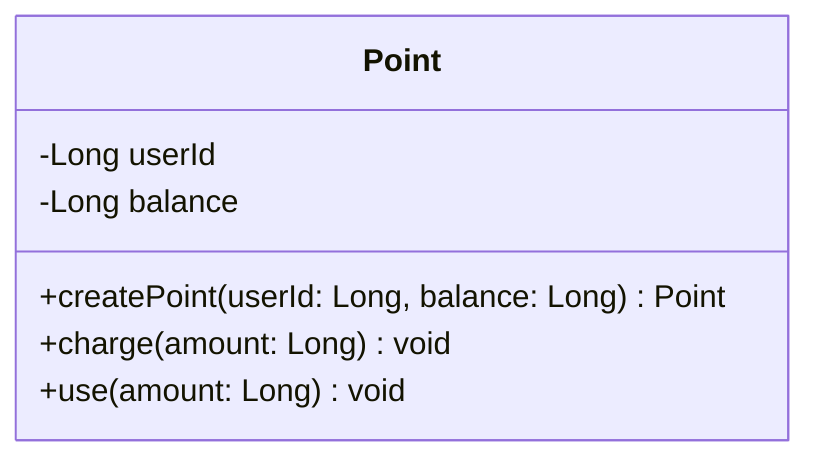
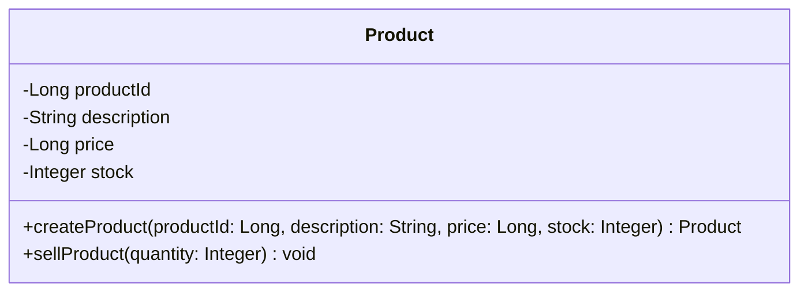
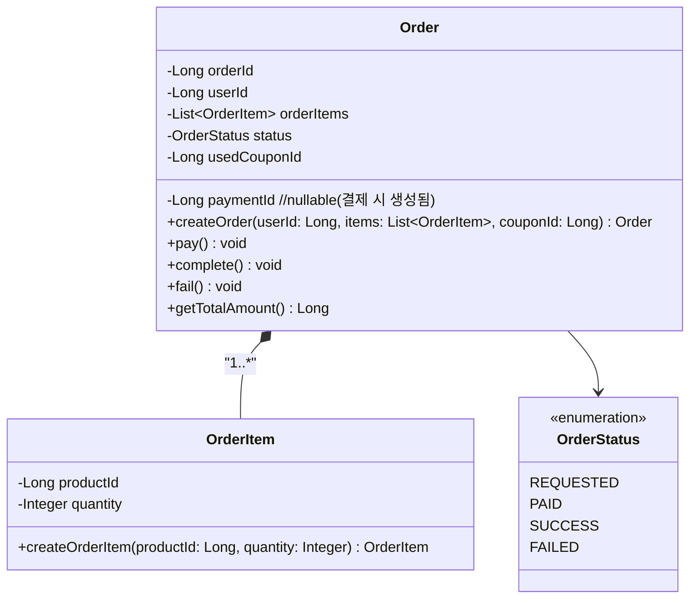
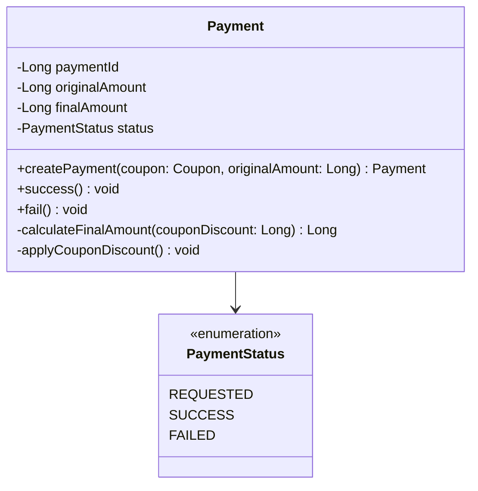
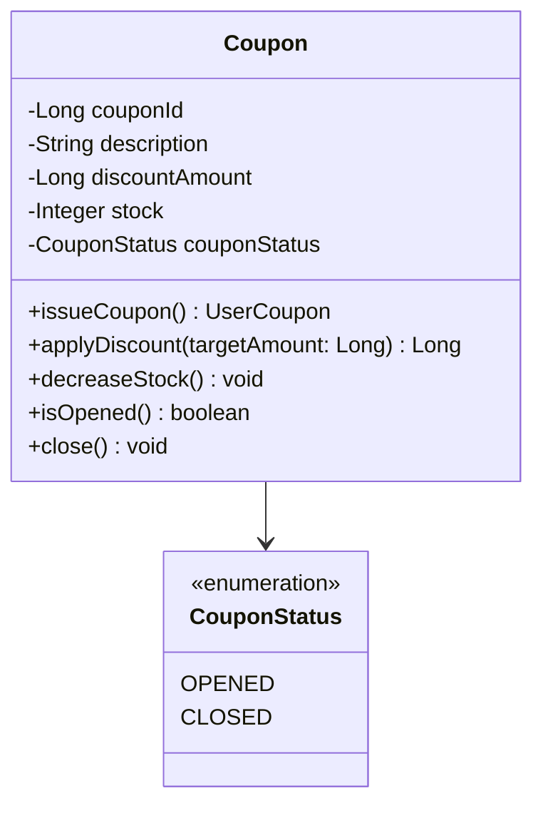
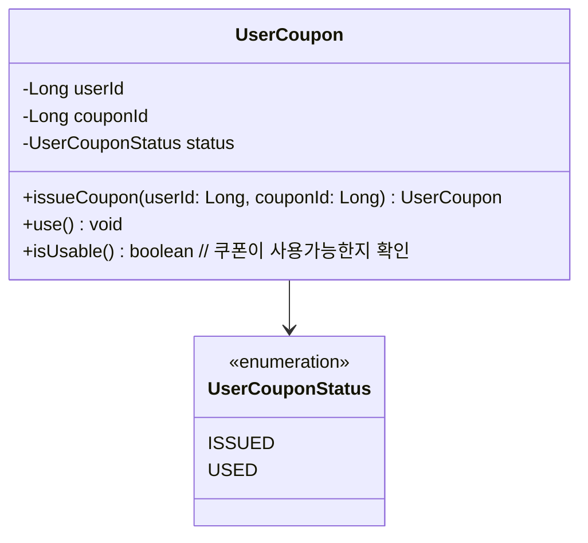

# 포인트 모델

```mermaid
classDiagram
    class Point {
        -Long userId
        -Long balance
        +createPoint(userId: Long, balance: Long) Point
        +charge(amount: Long) void
        +use(amount: Long) void
    }
```

# 상품 모델

```mermaid
classDiagram
    class Product {
        -Long productId
        -String description
        -Long price
        -Integer stock
        +createProduct(productId: Long, description: String, price: Long, stock: Integer) Product
        +sellProduct(quantity: Integer) void
    }


```

# 주문 모델

```mermaid
classDiagram
    class Order {
        -Long orderId
        -Long userId
        -Long paymentId //nullable(결제 시 생성됨)
        -List~OrderItem~ orderItems
        -OrderStatus status
        -Long usedCouponId
        +createOrder(userId: Long, items: List~OrderItem~, couponId: Long) Order
        +pay() void
        +complete() void
        +fail() void
        +getTotalAmount() Long
    }

    class OrderItem {
        -Long productId
        -Integer quantity
        +createOrderItem(productId: Long, quantity: Integer) OrderItem
    }

    class OrderStatus {
        <<enumeration>>
        REQUESTED
        PAID
        SUCCESS
        FAILED
    }

    Order *-- OrderItem : "1..*"
    Order --> OrderStatus

```

# 결제 모델

```mermaid
classDiagram
    class Payment {
        -Long paymentId
        -Long originalAmount
        -Long finalAmount
        -PaymentStatus status
        +createPayment(coupon: Coupon, originalAmount: Long) Payment
        +success() void
        +fail() void
        -calculateFinalAmount(couponDiscount: Long) Long
        -applyCouponDiscount() void
    }

    class PaymentStatus {
        <<enumeration>>
        REQUESTED
        SUCCESS
        FAILED
    }

    Payment --> PaymentStatus

```

# 선착순 쿠폰 모델

```mermaid
classDiagram
    class Coupon {
        -Long couponId
        -String description
        -Long discountAmount
        -Integer stock
        -CouponStatus couponStatus
        +issueCoupon() UserCoupon
        +applyDiscount(targetAmount: Long) Long
        +decreaseStock() void
        +isOpened() boolean
        +close() void
    }

    class CouponStatus {
        <<enumeration>>
        OPENED
        CLOSED
    }

    Coupon --> CouponStatus

```

# 유저 쿠폰 모델

```mermaid
classDiagram
    class UserCoupon {
        -Long userId
        -Long couponId
        -UserCouponStatus status
        +issueCoupon(userId: Long, couponId: Long) UserCoupon
        +use() void
        +isUsable() boolean // 쿠폰이 사용가능한지 확인
    }

    class UserCouponStatus {
        <<enumeration>>
        ISSUED
        USED
    }

    UserCoupon --> UserCouponStatus

```
