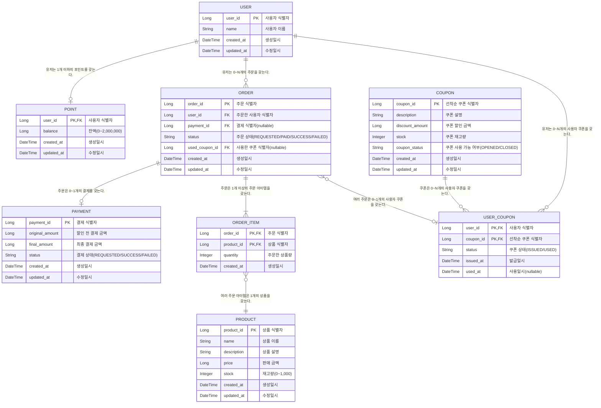

```mermaid
erDiagram
    USER {
        Long user_id PK "사용자 식별자"
        String name "사용자 이름"
        DateTime created_at "생성일시"
        DateTime updated_at "수정일시"
    }

    POINT {
        Long user_id PK,FK "사용자 식별자"
        Long balance "잔액(0~2,000,000)"
        DateTime created_at "생성일시"
        DateTime updated_at "수정일시"
    }

    PRODUCT {
        Long product_id PK "상품 식별자"
        String name "상품 이름"
        String description "상품 설명"
        Long price "판매 금액"
        Integer stock "재고량(0~1,000)"
        DateTime created_at "생성일시"
        DateTime updated_at "수정일시"
    }

    ORDER {
        Long order_id PK "주문 식별자"
        Long user_id FK "주문한 사용자 식별자"
        Long payment_id FK "결제 식별자(nullable)"
        String status "주문 상태(REQUESTED/PAID/SUCCESS/FAILED)"
        Long used_coupon_id FK "사용한 쿠폰 식별자(nullable)"
        DateTime created_at "생성일시"
        DateTime updated_at "수정일시"
    }

    ORDER_ITEM {
        Long order_id PK,FK "주문 식별자"
        Long product_id PK,FK "상품 식별자"
        Integer quantity "주문한 상품량"
        DateTime created_at "생성일시"
    }

    PAYMENT {
        Long payment_id PK "결제 식별자"
        Long original_amount "할인 전 결제 금액"
        Long final_amount "최종 결제 금액"
        String status "결제 상태(REQUESTED/SUCCESS/FAILED)"
        DateTime created_at "생성일시"
        DateTime updated_at "수정일시"
    }

    COUPON {
        Long coupon_id PK "선착순 쿠폰 식별자"
        String description "쿠폰 설명"
        Long discount_amount "쿠폰 할인 금액"
        Integer stock "쿠폰 재고량"
        String coupon_status "쿠폰 사용 가능 여부(OPENED/CLOSED)"
        DateTime created_at "생성일시"
        DateTime updated_at "수정일시"
    }

    USER_COUPON {
        Long user_id PK,FK "사용자 식별자"
        Long coupon_id PK,FK "선착순 쿠폰 식별자"
        String status "쿠폰 상태(ISSUED/USED)"
        DateTime issued_at "발급일시"
        DateTime used_at "사용일시(nullable)"
    }

    %% 관계 정의
    USER ||--o| POINT : "유저는 1개 이하의 포인트를 갖는다."
    USER ||--o{ ORDER : "유저는 0~N개의 주문을 갖는다."
    USER ||--o{ USER_COUPON : "유저는 0~N개의 사용자 쿠폰을 갖는다."

    ORDER ||--o| PAYMENT : "주문은 0~1개의 결제를 갖는다."
    ORDER ||--|{ ORDER_ITEM : "주문은 1개 이상의 주문 아이템을 갖는다."
    ORDER }o--o| USER_COUPON : "여러 주문은 0~1개의 사용자 쿠폰을 갖는다."

    ORDER_ITEM }o--|| PRODUCT : "여러 주문 아이템은 1개의 상품을 갖는다."

    COUPON ||--o{ USER_COUPON : "쿠폰은 0~N개의 사용자 쿠폰을 갖는다."

```
