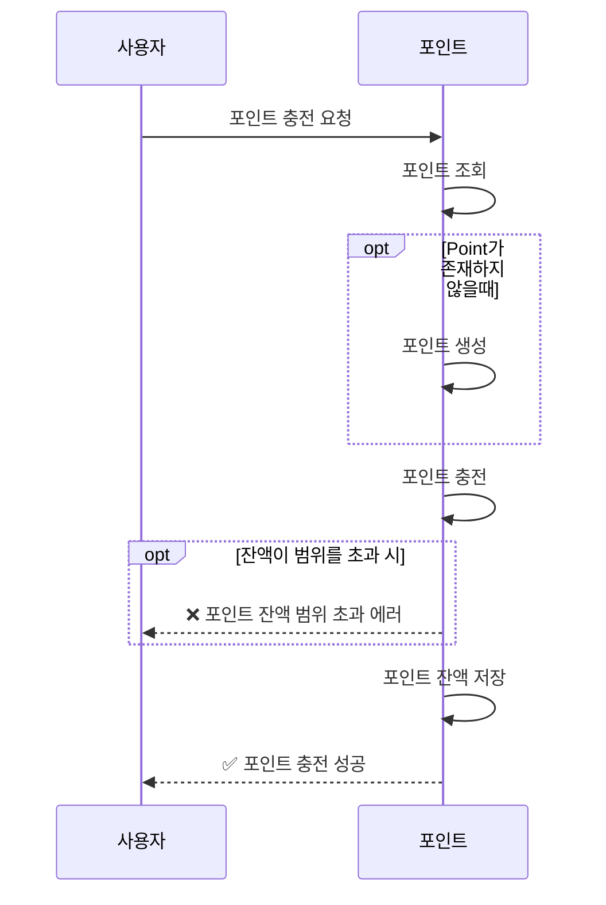
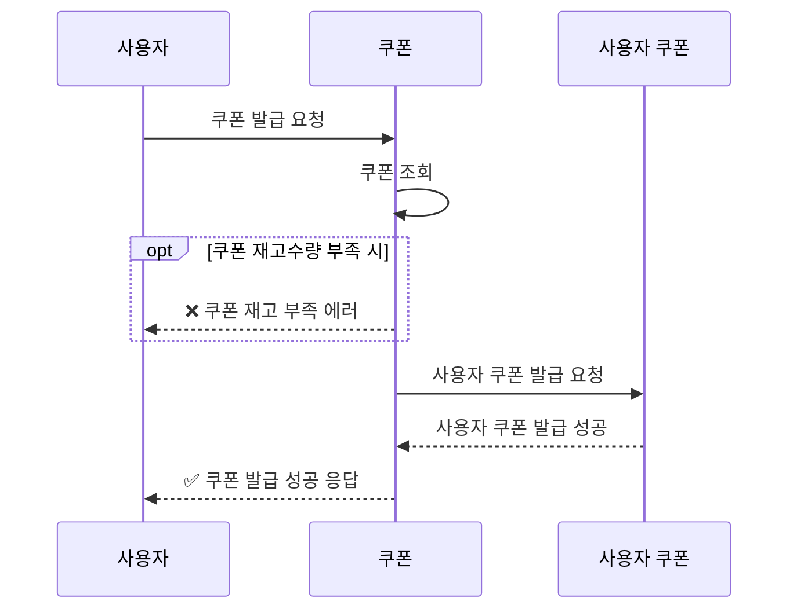
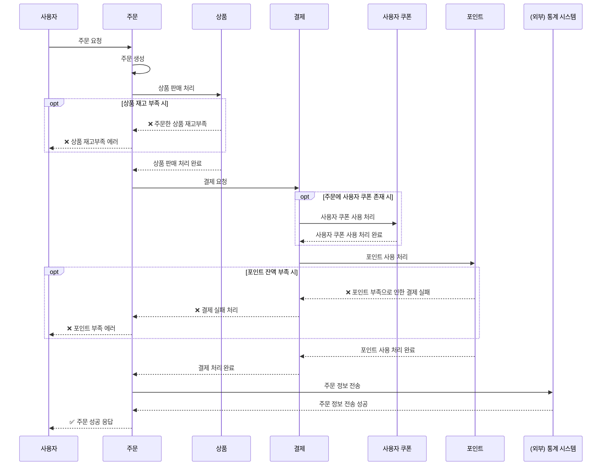

# 시퀀스 다이어그램

- 이커머스 주요 유스케이스에 대한 로직을 시퀀스 다이어그램으로 표현하였습니다.
  (단순 조회의 경우, 생략)

## 사용자의 포인트 충전 유스케이스

```mermaid
sequenceDiagram
	participant User as 사용자
	participant Point as 포인트

User->> Point: 포인트 충전 요청
Point ->> Point : 포인트 조회
opt Point가 존재하지 않을때
Point->> Point: 포인트 생성
end


Point ->> Point : 포인트 충전
opt 잔액이 범위를 초과 시
Point -->> User: ❌ 포인트 잔액 범위 초과 에러
end

Point ->> Point : 포인트 잔액 저장
Point -->> User: ✅ 포인트 충전 성공

```

## 선착순 쿠폰 발급 유스케이스

```mermaid
sequenceDiagram
	participant User as 사용자
	participant Coupon as 쿠폰
  participant UC as 사용자 쿠폰
  
 
 User->>Coupon : 쿠폰 발급 요청
 Coupon ->> Coupon : 쿠폰 조회
 opt 쿠폰 재고수량 부족 시
 Coupon -->> User : ❌ 쿠폰 재고 부족 에러
 end
 
 Coupon ->> UC : 사용자 쿠폰 발급 요청
 UC -->> Coupon : 사용자 쿠폰 발급 성공
 
 Coupon -->> User : ✅ 쿠폰 발급 성공 응답
 
 
 

```

## 주문 및 결제 유스케이스    

```mermaid
sequenceDiagram
    participant User as 사용자
    participant Order as 주문
    participant Product as 상품
    participant Payment as 결제
    participant UserCoupon as 사용자 쿠폰
    participant Point as 포인트
    participant ST as (외부) 통계 시스템
    
    User ->> Order : 주문 요청
    Order ->> Order : 주문 생성
    
    Order ->> Product : 상품 판매 처리
    opt 상품 재고 부족 시
	    Product -->> Order: ❌ 주문한 상품 재고부족
	    Order -->> User : ❌ 상품 재고부족 에러
    end
    Product -->> Order : 상품 판매 처리 완료
    
    Order ->> Payment : 결제 요청
    opt 주문에 사용자 쿠폰 존재 시
    Payment ->> UserCoupon : 사용자 쿠폰 사용 처리
    UserCoupon -->> Payment : 사용자 쿠폰 사용 처리 완료
    end
    Payment ->> Point : 포인트 사용 처리
    opt 포인트 잔액 부족 시
	    Point -->> Payment: ❌ 포인트 부족으로 인한 결제 실패
  	  Payment -->> Order: ❌ 결제 실패 처리
  	  Order -->> User : ❌ 포인트 부족 에러
	    
    end
    Point -->> Payment : 포인트 사용 처리 완료
    Payment -->> Order : 결제 처리 완료
    
    Order ->> ST : 주문 정보 전송
    ST -->> Order : 주문 정보 전송 성공
    Order -->> User : ✅ 주문 성공 응답
    
    
    
    
```
