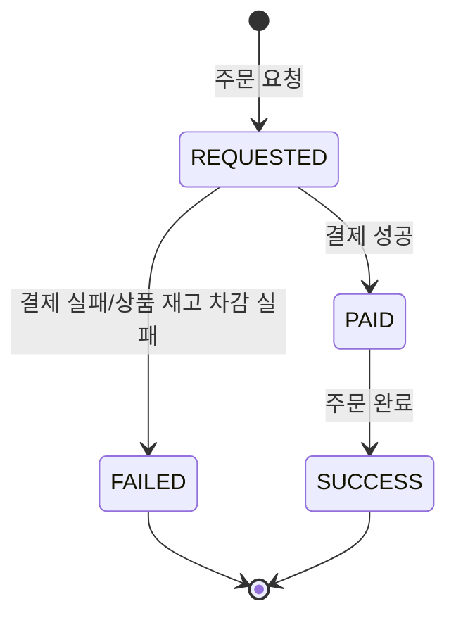
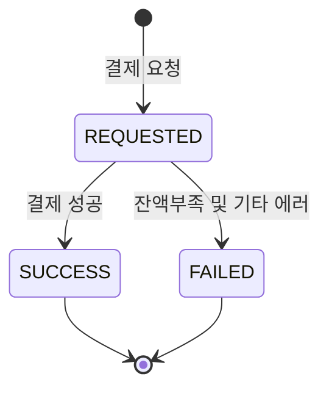
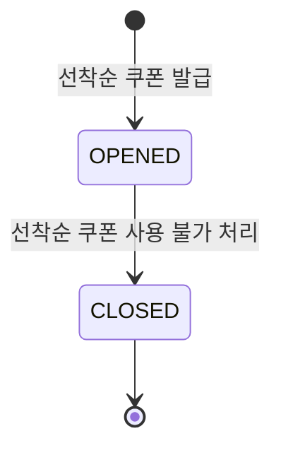
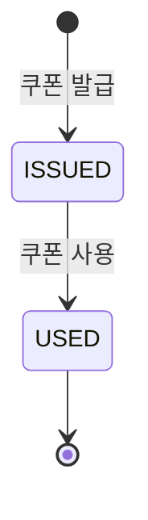

### **주문(Order)**

```mermaid
stateDiagram-v2
[*] --> REQUESTED: 주문 요청
REQUESTED --> PAID: 결제 성공
REQUESTED --> FAILED: 결제 실패/상품 재고 차감 실패
PAID --> SUCCESS: 주문 완료
FAILED --> [*]
SUCCESS --> [*]
```

### **결제(Payment)**

```mermaid
stateDiagram-v2
[*] --> REQUESTED : 결제 요청
REQUESTED --> SUCCESS: 결제 성공
REQUESTED --> FAILED: 잔액부족 및 기타 에러
SUCCESS --> [*]
FAILED --> [*]
```

### **선착순 쿠폰 모델**

```mermaid
stateDiagram-v2
[*] --> OPENED : 선착순 쿠폰 발급
    OPENED --> CLOSED: 선착순 쿠폰 사용 불가 처리
    CLOSED --> [*]

```

### **쿠폰(UserCoupon)**

```mermaid
stateDiagram-v2
[*] --> ISSUED : 쿠폰 발급
ISSUED --> USED: 쿠폰 사용
USED --> [*]
```
