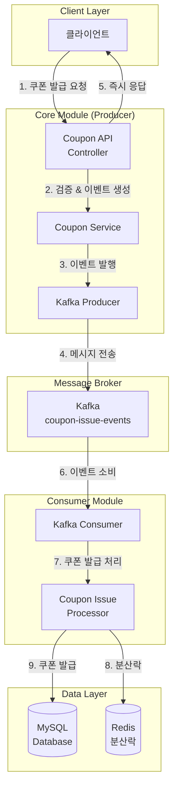
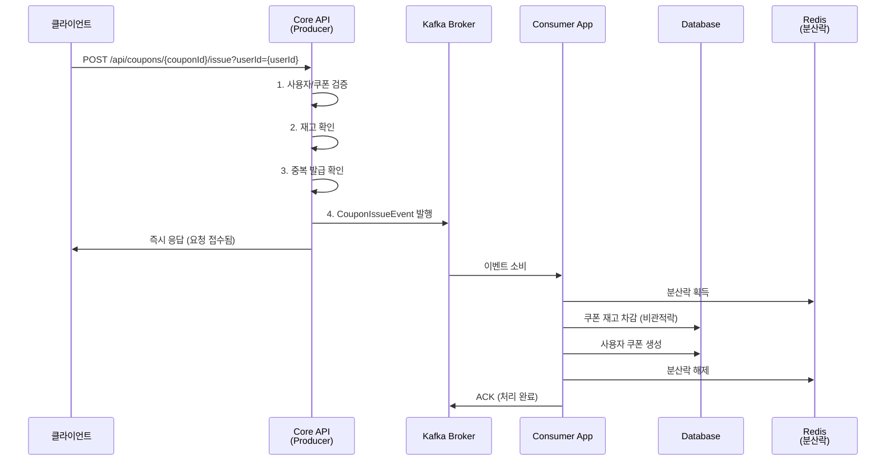
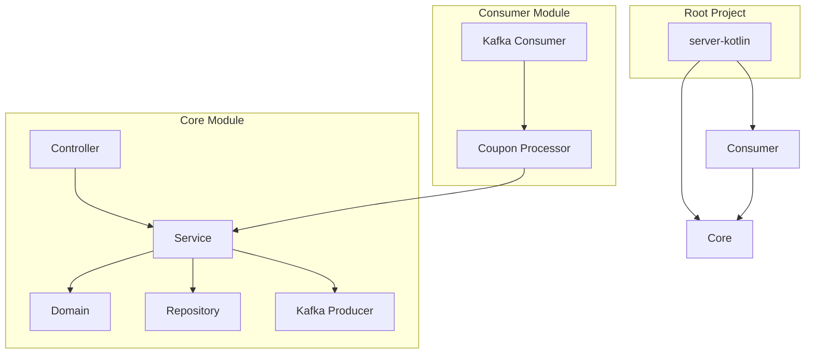

# Kafka를 활용한 쿠폰 발급 시스템 개선 및 테스트 가이드

## 📋 목차
1. [시스템 개요](#시스템-개요)
2. [아키텍처](#아키텍처)
3. [멀티모듈 구조](#멀티모듈-구조)
4. [Kafka Pub/Sub 구조](#kafka-pubsub-구조)
5. [테스트 가이드](#테스트-가이드)
6. [모니터링](#모니터링)

---

## 🎯 시스템 개요

기존 스케줄러 기반 쿠폰 발급 시스템을 **Kafka 기반 이벤트 드리븐 아키텍처**로 개선한 시스템입니다.

### 주요 개선사항
- **비동기 처리**: 쿠폰 발급 요청과 처리 분리
- **높은 처리량**: Kafka의 고성능 메시징으로 대량 요청 처리
- **확장성**: Consumer 인스턴스 수평 확장 가능
- **순서 보장**: 파티션 키를 통한 쿠폰별 순서 보장
- **내결함성**: 메시지 재처리 및 에러 핸들링

---

## 🏗️ 아키텍처



### 처리 흐름



---

## 📦 멀티모듈 구조



### 모듈별 역할

#### 🎯 Core Module
- **역할**: 웹 API 제공, 비즈니스 로직, Kafka Producer
- **포트**: 8080
- **구성요소**:
  - REST API Controller
  - 쿠폰 도메인 로직
  - Kafka Event Producer
  - Repository 계층

#### 🔄 Consumer Module  
- **역할**: Kafka 메시지 소비, 실제 쿠폰 발급 처리
- **포트**: 8081 (Actuator용)
- **구성요소**:
  - Kafka Event Consumer
  - 쿠폰 발급 Processor
  - Core 모듈 의존성 활용

### 빌드 구성

```kotlin
// settings.gradle.kts
rootProject.name = "server"
include("core")
include("consumer")

// consumer/build.gradle.kts 핵심 의존성
dependencies {
    implementation(project(":core"))  // Core 모듈 의존
    implementation("org.springframework.kafka:spring-kafka")
    implementation("org.redisson:redisson-spring-boot-starter:3.24.3")
}
```

---

## 🔄 Kafka Pub/Sub 구조

### Producer (Core Module)

#### CouponIssueEvent 도메인
```kotlin
data class CouponIssueEvent(
    val eventId: String,       // 고유 이벤트 ID
    val userId: Long,          // 사용자 ID  
    val couponId: Long,        // 쿠폰 ID
    val timestamp: Long,       // 타임스탬프
    val version: Int = 1       // 이벤트 버전
) {
    // 파티션 키 생성 (같은 쿠폰은 같은 파티션으로)
    fun getPartitionKey(): String = "coupon-$couponId"
}
```

#### Producer 설정
```yaml
# core/src/main/resources/application.yml
spring:
  kafka:
    bootstrap-servers: localhost:9092
    producer:
      key-serializer: org.apache.kafka.common.serialization.StringSerializer
      value-serializer: org.apache.kafka.common.serialization.StringSerializer
      acks: all                    # 모든 복제본 확인
      retries: 3                   # 재시도 횟수
      properties:
        enable.idempotence: true   # 중복 방지
        max.in.flight.requests.per.connection: 1  # 순서 보장

app:
  kafka:
    topic:
      coupon-issue: coupon-issue-events
```

#### Producer 구현체
```kotlin
@Service
class CouponIssueEventProducer(
    private val kafkaTemplate: KafkaTemplate<String, String>,
    private val objectMapper: ObjectMapper
) {
    fun publishCouponIssueEvent(event: CouponIssueEvent): Boolean {
        val messagePayload = objectMapper.writeValueAsString(event)
        val partitionKey = event.getPartitionKey()
        
        kafkaTemplate.send(topicName, partitionKey, messagePayload)
        return true
    }
}
```

### Consumer (Consumer Module)

#### Consumer 설정
```yaml
# consumer/src/main/resources/application.yml
spring:
  kafka:
    bootstrap-servers: localhost:9092
    consumer:
      group-id: coupon-issue-consumer-group
      auto-offset-reset: earliest
      key-deserializer: org.apache.kafka.common.serialization.StringDeserializer
      value-deserializer: org.apache.kafka.common.serialization.StringDeserializer
      enable-auto-commit: false    # 수동 커밋으로 정확성 보장
      properties:
        max.poll.records: 10       # 한 번에 처리할 메시지 수
        max.poll.interval.ms: 300000
```

#### Consumer 구현체
```kotlin
@Service
class CouponIssueEventConsumer(
    private val objectMapper: ObjectMapper,
    private val couponIssueProcessor: CouponIssueProcessor,
) {
    @KafkaListener(
        topics = ["\${app.kafka.topic.coupon-issue}"],
        groupId = "\${spring.kafka.consumer.group-id}",
    )
    fun handleCouponIssueEvent(
        @Payload payload: String,
        @Header(KafkaHeaders.RECEIVED_PARTITION) partition: Int,
        @Header(KafkaHeaders.OFFSET) offset: Long,
        acknowledgment: Acknowledgment,
    ) {
        try {
            // 1. JSON 역직렬화
            val event = objectMapper.readValue(payload, CouponIssueEvent::class.java)
            
            // 2. 이벤트 검증
            if (!event.isValid()) {
                acknowledgment.acknowledge()
                return
            }
            
            // 3. 실제 쿠폰 발급 처리
            val request = event.toCouponIssueRequest()
            val result = couponIssueProcessor.processRequest(request)
            
            // 4. 결과에 따른 ACK 처리
            if (result.isSuccess()) {
                acknowledgment.acknowledge()
            } else {
                if (result.isRetryable()) {
                    throw RuntimeException("재시도 가능한 오류")
                } else {
                    acknowledgment.acknowledge() // 비즈니스 오류는 재시도 안함
                }
            }
        } catch (e: Exception) {
            // 시스템 오류는 재시도를 위해 예외 다시 던지기
            throw e
        }
    }
}
```

### 핵심 특징

#### 1. 순서 보장
- **파티션 키**: `coupon-{couponId}` 형식으로 쿠폰별 파티셔닝
- **같은 쿠폰 요청**: 항상 같은 파티션으로 라우팅되어 순서 보장

#### 2. 내결함성
- **수동 커밋**: 처리 완료 후에만 오프셋 커밋
- **재시도 로직**: 시스템 오류는 재시도, 비즈니스 오류는 스킵
- **멱등성**: Producer의 idempotence 설정으로 중복 방지

#### 3. 동시성 제어
- **분산락**: Redis 기반 분산락으로 쿠폰별 동시성 제어
- **비관적 락**: 데이터베이스 레벨 락으로 재고 정합성 보장

---

## 🧪 테스트 가이드

### 1. 환경 설정

#### Docker 인프라 실행
```bash
# 프로젝트 루트에서 실행
docker-compose up -d

# 실행 확인
docker-compose ps

# 로그 확인  
docker-compose logs kafka
docker-compose logs mysql
```

#### Kafka 상태 확인
```bash
# Kafka UI 접속 (선택사항)
# http://localhost:9090

# 토픽 생성 확인 (애플리케이션 실행 후)
docker exec -it kafka kafka-topics --bootstrap-server localhost:9092 --list
```

### 2. 애플리케이션 실행

#### Core 애플리케이션 실행 (Producer)
```bash
# 터미널 1: Core 애플리케이션 실행
cd /Users/lostcatbox/MyFiles/Codes/hanghae99/restudyHanghae99Until202508/2week/server-kotlin

# Gradle로 실행
./gradlew :core:bootRun

# 또는 IntelliJ에서 ServerApplication.kt 실행
# 포트: 8080
```

#### Consumer 애플리케이션 실행
```bash  
# 터미널 2: Consumer 애플리케이션 실행 
cd /Users/lostcatbox/MyFiles/Codes/hanghae99/restudyHanghae99Until202508/2week/server-kotlin

# Gradle로 실행
./gradlew :consumer:bootRun

# 또는 IntelliJ에서 CouponIssueConsumerApplication.kt 실행
# 포트: 8081 (Actuator만)
```

### 3. 테스트 데이터 준비

#### 사용자 추가 (필요시 직접 DB 삽입)
```bash
# MySQL 접속
docker exec -it [mysql_container_id] mysql -u application -p e_commerce_db

# 사용자 데이터 삽입
INSERT INTO user (user_id, name, created_at, updated_at) VALUES 
(1, 'testuser1', NOW(), NOW()),
(2, 'testuser2', NOW(), NOW()),
(3, 'testuser3', NOW(), NOW());

# 포인트 데이터 삽입  
INSERT INTO point (user_id, balance, created_at, updated_at) VALUES
(1, 100000, NOW(), NOW()),
(2, 100000, NOW(), NOW()),
(3, 100000, NOW(), NOW());
```

#### 쿠폰 추가
```bash
# 쿠폰 데이터 삽입
INSERT INTO coupon (coupon_id, description, discount_amount, stock, coupon_status, created_at, updated_at) VALUES
(1, '신규가입 할인쿠폰', 5000, 100, 'OPENED', NOW(), NOW());
```

### 4. API 테스트

#### 쿠폰 정보 조회
```bash
curl -v -X GET "http://localhost:8080/api/coupons/1"
```

#### 쿠폰 발급 요청 (핵심 테스트)
```bash
# 사용자 1 쿠폰 발급
curl -v -X POST "http://localhost:8080/api/coupons/1/issue?userId=1"

# 사용자 2 쿠폰 발급  
curl -v -X POST "http://localhost:8080/api/coupons/1/issue?userId=2"

# 사용자 3 쿠폰 발급
curl -v -X POST "http://localhost:8080/api/coupons/1/issue?userId=3"
```

#### 응답 예시
```json
{
  "success": true,
  "message": "쿠폰 발급 요청이 정상적으로 접수되었습니다. 잠시 후 쿠폰이 발급됩니다.",
  "requestId": "12345678-1234-1234-1234-123456789abc"
}
```

### 5. 동작 확인

#### Consumer 로그 확인
```bash
# Consumer 애플리케이션 로그에서 다음과 같은 메시지 확인
# "쿠폰 발급 이벤트 수신 - Partition: 0, Offset: 0"
# "쿠폰 발급 이벤트 처리 시작 - EventId: xxx, UserId: 1, CouponId: 1"  
# "쿠폰 발급 성공 - EventId: xxx, UserCouponId: 1"
```

#### 데이터베이스 확인
```bash
# 쿠폰 재고 확인
SELECT coupon_id, stock FROM coupon WHERE coupon_id = 1;

# 사용자 쿠폰 발급 확인
SELECT * FROM user_coupon WHERE coupon_id = 1;
```

### 6. 성능 테스트

#### 동시 요청 테스트 (Apache Bench)
```bash
# 100개 동시 요청
ab -n 100 -c 10 -H "Content-Type: application/json" \
   "http://localhost:8080/api/coupons/1/issue?userId=1"
```

#### 부하 테스트 스크립트 예시
```bash
#!/bin/bash
# 여러 사용자가 동시에 쿠폰 발급 요청

for i in {1..50}; do
  curl -X POST "http://localhost:8080/api/coupons/1/issue?userId=$i" &
done

wait
echo "모든 요청 완료"
```

### 7. 오류 상황 테스트

#### 중복 발급 테스트
```bash
# 같은 사용자로 두 번 요청
curl -v -X POST "http://localhost:8080/api/coupons/1/issue?userId=1"
curl -v -X POST "http://localhost:8080/api/coupons/1/issue?userId=1"
```

#### 재고 부족 테스트
```bash
# 쿠폰 재고를 0으로 설정 후 요청
UPDATE coupon SET stock = 0 WHERE coupon_id = 1;

curl -v -X POST "http://localhost:8080/api/coupons/1/issue?userId=1"
```

### 8. 문제 해결

#### Consumer가 메시지를 처리하지 않는 경우
```bash
# Kafka 토픽 확인
docker exec -it kafka kafka-topics --bootstrap-server localhost:9092 --describe --topic coupon-issue-events

# Consumer 그룹 상태 확인  
docker exec -it kafka kafka-consumer-groups --bootstrap-server localhost:9092 --describe --group coupon-issue-consumer-group
```

#### 데이터베이스 연결 오류
```bash
# MySQL 연결 확인
docker exec -it [mysql_container_id] mysqladmin -u application -p ping

# 애플리케이션 로그에서 HikariCP 관련 오류 확인
```

---

## 📊 모니터링

### 1. 애플리케이션 상태 확인

#### Actuator 엔드포인트
```bash
# Core 애플리케이션 상태
curl http://localhost:8080/actuator/health

# Consumer 애플리케이션 상태  
curl http://localhost:8081/actuator/health
```

### 2. Kafka 모니터링

#### Kafka UI (개발용)
- **URL**: http://localhost:9090
- **기능**: 토픽, 파티션, 컨슈머 그룹 상태 확인

#### 주요 메트릭
- **메시지 처리량**: 초당 처리된 메시지 수
- **Consumer Lag**: Consumer 처리 지연 정도
- **파티션 분산**: 메시지의 파티션별 분산 상태

### 3. 로그 모니터링

#### Core 애플리케이션 로그
```bash
# Producer 이벤트 발행 로그
tail -f logs/core/application.log | grep "쿠폰 발급 이벤트 발행"
```

#### Consumer 애플리케이션 로그
```bash  
# Consumer 이벤트 처리 로그
tail -f logs/consumer/application.log | grep "쿠폰 발급 이벤트"
```

---

## 🔧 설정 최적화

### 1. 성능 튜닝

#### Producer 설정
```yaml
spring:
  kafka:
    producer:
      batch-size: 16384         # 배치 크기 조정
      linger-ms: 5              # 배치 대기 시간
      buffer-memory: 33554432   # 버퍼 메모리 크기
```

#### Consumer 설정  
```yaml
spring:
  kafka:
    consumer:
      properties:
        max.poll.records: 500          # 한 번에 처리할 메시지 수 증가
        fetch.min.bytes: 1024          # 최소 fetch 크기
        fetch.max.wait.ms: 500         # 최대 대기 시간
```

### 2. 확장성 고려사항

#### 파티션 수 증가
```bash
# 토픽 파티션 수 증가 (처리량 향상)
docker exec -it kafka kafka-topics --bootstrap-server localhost:9092 \
  --alter --topic coupon-issue-events --partitions 3
```

#### Consumer 인스턴스 확장
```bash
# 여러 Consumer 인스턴스 실행 (수평 확장)
./gradlew :consumer:bootRun --args='--server.port=8082'
./gradlew :consumer:bootRun --args='--server.port=8083'
```

---

## 🚀 운영 가이드

### 1. 배포 전 체크리스트
- [ ] Docker 컨테이너 상태 확인
- [ ] Kafka 토픽 생성 확인  
- [ ] 데이터베이스 스키마 업데이트
- [ ] 환경별 설정 파일 확인
- [ ] 로그 레벨 설정 확인

### 2. 장애 대응
- **Producer 장애**: API 응답 지연, 에러율 모니터링
- **Consumer 장애**: 메시지 적체, Consumer Lag 증가
- **Kafka 장애**: 브로커 상태, 토픽 접근성 확인

### 3. 백업 및 복구
- **Kafka 오프셋**: Consumer 그룹별 오프셋 백업
- **데이터베이스**: 정기적인 데이터 백업
- **설정 파일**: 환경별 설정 버전 관리

---

## 📝 결론

Kafka 기반 쿠폰 발급 시스템은 기존 스케줄러 방식 대비 다음과 같은 장점을 제공합니다:

- **높은 처리량**: 초당 수천 건의 요청 처리 가능
- **즉시 응답**: 사용자에게 빠른 피드백 제공  
- **확장성**: Consumer 인스턴스 수평 확장으로 처리량 증대
- **내결함성**: 메시지 재처리를 통한 안정성 확보
- **순서 보장**: 파티션 키를 통한 쿠폰별 순서 처리

이러한 아키텍처를 통해 대규모 트래픽 상황에서도 안정적이고 효율적인 쿠폰 발급 서비스를 제공할 수 있습니다.
