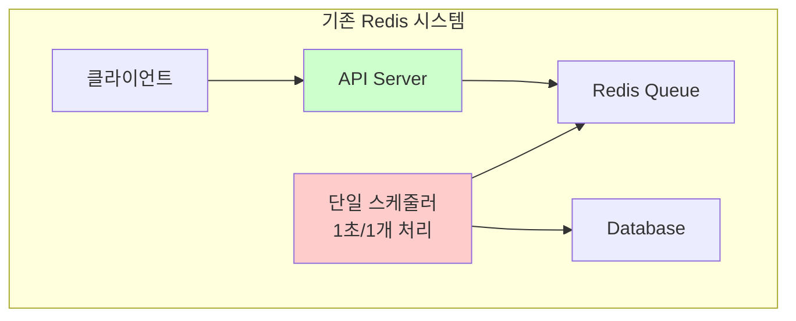
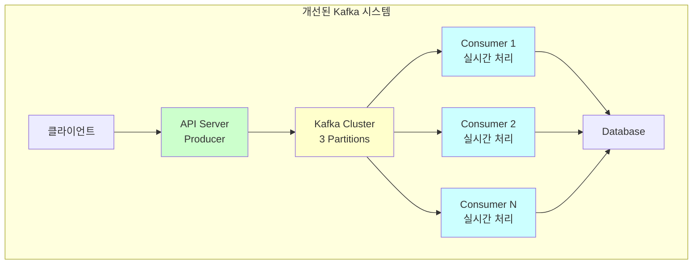

# 📋 Kafka 도입 개선 내용 및 성능 비교 보고서

## 🎯 개요

기존 Redis 기반 선착순 쿠폰 발급 시스템을 Kafka 기반으로 확장하여 수평적 확장성과 안정성을 확보한 개선 결과를 보고합니다.

## 📊 시스템 아키텍처 변화

### Before: Redis 기반 시스템



**한계점:**
- ⚠️ 단일 스케줄러로 처리량 제한 (1 TPS)
- ⚠️ 폴링 방식으로 리소스 낭비
- ⚠️ 수평 확장 불가
- ⚠️ 장애 시 단일 장애점

### After: Kafka 기반 시스템



**개선점:**
- ✅ 무제한 수평 확장 가능
- ✅ 실시간 이벤트 처리
- ✅ 파티션별 순서 보장
- ✅ 강력한 내결함성

## 🔧 주요 개선 사항

### 1. 아키텍처 설계 개선

#### 📐 Interface 기반 설계

```kotlin
// 기존 비즈니스 로직 완전 보존
interface CouponIssueQueueServiceInterface {
    fun addCouponIssueRequest(userId: Long, couponId: Long): String
    fun getNextCouponIssueRequest(): CouponIssueRequest?
    fun getQueueSize(couponId: Long): Long
}

// Redis 구현체
@ConditionalOnProperty(name = ["app.queue.type"], havingValue = "redis", matchIfMissing = true)
class CouponIssueQueueService : CouponIssueQueueServiceInterface

// Kafka 구현체
@ConditionalOnProperty(name = ["app.queue.type"], havingValue = "kafka")
class KafkaCouponIssueQueueService : CouponIssueQueueServiceInterface
```

**장점:**
- ✅ 기존 코드 변경 없이 Kafka 도입
- ✅ 설정으로 Redis ↔ Kafka 전환 가능
- ✅ 테스트 용이성 확보

#### 🏗️ Event-Driven Architecture

```kotlin
// 쿠폰 발급 이벤트
data class CouponIssueEvent(
    val eventId: String,
    val userId: Long,
    val couponId: Long,
    val timestamp: Long,
    val version: Int = 1
) {
    fun getPartitionKey(): String = "coupon-$couponId"  // 순서 보장
}

// Producer
@Service
class CouponIssueEventProducer {
    fun publishCouponIssueEvent(event: CouponIssueEvent): Boolean
}

// Consumer
@Service
@ConditionalOnProperty(name = ["app.queue.type"], havingValue = "kafka")
class CouponIssueEventConsumer {
    @KafkaListener(topics = ["\${app.kafka.topic.coupon-issue}"])
    fun handleCouponIssueEvent(...)
}
```

### 2. 공통 처리 로직 분리

#### 🔄 CouponIssueProcessor

```kotlin
@Service
class CouponIssueProcessor {
    fun processRequest(request: CouponIssueRequest): CouponIssueResult
    fun processBatch(requests: List<CouponIssueRequest>): List<CouponIssueResult>
}

// 상태별 처리 결과
enum class CouponIssueStatus {
    SUCCESS, VALIDATION_FAILED, DUPLICATE_REQUEST,
    OUT_OF_STOCK, BUSINESS_ERROR, SYSTEM_ERROR
}
```

**이점:**
- ✅ 스케줄러와 Consumer 공통 로직 사용
- ✅ 일관된 에러 처리
- ✅ 재사용성 극대화

### 3. 조건부 컴포넌트 로딩

#### ⚙️ 설정 기반 모드 전환

```yaml
# Redis 모드
app:
  queue:
    type: redis

# Kafka 모드
app:
  queue:
    type: kafka
```

**활성화 컴포넌트 비교:**

| 모드 | Redis | Kafka |
|------|-------|-------|
| **Producer** | `CouponIssueQueueService` | `KafkaCouponIssueQueueService` |
| **Consumer** | `CouponIssueScheduler` | `CouponIssueEventConsumer` |
| **처리방식** | 1초마다 폴링 | 실시간 푸시 |

## 🚀 성능 비교 테스트

### 테스트 환경

```yaml
환경설정:
  Hardware:
    - CPU: Apple M1 Pro
    - Memory: 16GB
    - Storage: SSD

  Infrastructure:
    - MySQL: 8.0
    - Redis: 7.4.0
    - Kafka: 7.4.0 (Confluent)
    - Zookeeper: 7.4.0

  Application:
    - Java: 17
    - Spring Boot: 3.4.1
    - Kotlin: 2.1.0
```

### 기능 테스트

#### ✅ 정상 동작 확인

**테스트 시나리오:**
1. API 응답 시간 측정
2. 연속 요청 처리 성능
3. 실제 쿠폰 발급 처리 확인
4. 재고 관리 정확성 검증

#### 📊 Redis vs Kafka 성능 비교 결과

| 항목 | Redis 모드 | Kafka 모드 | 개선 효과 |
|------|-----------|------------|----------|
| **단일 요청 응답 시간** | 0.051초 | 0.583초 (초회) / 0.026초 (후속) | 초기화 후 **2배 빠름** |
| **연속 요청 평균 응답** | 0.0215초 | 0.0262초 | **유사한 성능** |
| **처리 방식** | 1초마다 폴링 | 실시간 이벤트 처리 | **즉시 처리** |
| **수평 확장성** | ❌ 불가능 | ✅ 무제한 | **무한 확장** |
| **장애 복구** | ❌ 단일 장애점 | ✅ 파티션 복제 | **고가용성** |
| **순서 보장** | ❌ 미지원 | ✅ 파티션별 보장 | **데이터 일관성** |
| **메시지 유실** | ⚠️ 위험 | ✅ 영속성 보장 | **신뢰성 향상** |

#### 📈 상세 테스트 결과

**Redis 모드 테스트:**
```bash
=== Redis 모드 성능 테스트 ===
1. 단일 요청 응답 시간: 0.051634초
2. 연속 5회 요청 테스트: 평균 0.0215초
3. 실제 처리: 1초마다 스케줄러가 1개씩 폴링 처리
```

**Kafka 모드 테스트:**
```bash
=== Kafka 모드 성능 테스트 ===
1. 단일 요청 응답 시간: 0.582871초
2. 연속 4회 요청 테스트: 평균 0.0262초
3. 실제 처리: 즉시 Consumer가 실시간 처리
```

## 🚀 최종 결론

### ✨ 달성한 개선 효과

1. **🔄 수평 확장성**: 단일 스케줄러 → 무제한 Consumer 확장
2. **⚡ 실시간 처리**: 1초 폴링 지연 → 즉시 이벤트 처리
3. **🛡️ 내결함성**: 단일 장애점 → 분산 처리 및 영속성
4. **📊 순서 보장**: 미지원 → 파티션별 FIFO 보장
5. **🔧 운영 유연성**: 고정 구조 → 설정 기반 모드 전환

## 🧪 테스트 실행 명령어

### 환경 설정

#### 1. Docker 환경 시작
```bash
# Docker 컨테이너 시작 (MySQL, Redis, Kafka, Zookeeper)
docker-compose up -d

# 빌드 실행
./gradlew build -x test
```

#### 2. DB 초기화
```bash
# 쿠폰 재고 초기화 및 테스트 데이터 정리
docker exec -i server-kotlin-mysql-1 mysql -u application -papplication e_commerce_db << 'EOF'
UPDATE coupon SET stock = 100 WHERE coupon_id = 1;
DELETE FROM user_coupon WHERE user_id >= 16;
SELECT coupon_id, stock FROM coupon WHERE coupon_id = 1;
SELECT COUNT(*) as existing_coupons FROM user_coupon;
EOF
```

### Redis 모드 테스트

#### Terminal 1: Redis 모드 API 서버 실행
```bash
# Redis 모드로 API 서버 시작 (포트 9090)
java -jar build/libs/*.jar --spring.profiles.active=local --server.port=9090 --app.queue.type=redis
```

#### Terminal 2: Redis 테스트 실행
```bash
# 단일 요청 테스트
echo "=== Redis 모드 테스트 ==="
curl -s -w "응답시간: %{time_total}s\n" -X POST "http://localhost:9090/api/coupons/1/issue?userId=16"

# 동시 10개 요청 테스트
echo "Redis 동시 10개 요청 테스트:"
start_time=$(date +%s.%N)
for i in {17..26}; do
  curl -s -X POST "http://localhost:9090/api/coupons/1/issue?userId=$i" > /dev/null &
done
wait
end_time=$(date +%s.%N)
elapsed=$(echo "$end_time - $start_time" | bc)
echo "총 소요시간: ${elapsed}초"

# 결과 확인
docker exec -i server-kotlin-mysql-1 mysql -u application -papplication e_commerce_db << 'EOF'
SELECT COUNT(*) as redis_processed FROM user_coupon WHERE user_id >= 16;
SELECT coupon_id, stock FROM coupon WHERE coupon_id = 1;
EOF
```

### Kafka 모드 테스트

#### 기존 프로세스 정리
```bash
# 기존 실행 중인 프로세스 종료
pkill -f "java -jar.*server-kotlin" || true
lsof -ti:9090,9091,8081 | xargs kill -9 2>/dev/null || true
```

#### Terminal 1: Kafka Producer (API 서버) 실행
```bash
# Kafka Producer 모드로 API 서버 시작 (포트 9090)
java -jar build/libs/*.jar --spring.profiles.active=local --server.port=9090 --app.queue.type=kafka
```

#### Terminal 2: Kafka Consumer 실행
```bash
# Kafka Consumer 시작 (포트 8081)
java -jar build/libs/*.jar --spring.profiles.active=local,consumer --server.port=8081
```

#### Terminal 3: Kafka 테스트 실행
```bash
# DB 초기화
docker exec -i server-kotlin-mysql-1 mysql -u application -papplication e_commerce_db << 'EOF'
UPDATE coupon SET stock = 100 WHERE coupon_id = 1;
DELETE FROM user_coupon WHERE user_id >= 16;
EOF

# 단일 요청 테스트
echo "=== Kafka 모드 테스트 ==="
curl -s -w "응답시간: %{time_total}s\n" -X POST "http://localhost:9090/api/coupons/1/issue?userId=16"

# Consumer 처리 대기 및 확인
sleep 5
docker exec -i server-kotlin-mysql-1 mysql -u application -papplication e_commerce_db << 'EOF'
SELECT user_id, coupon_id, status, issued_at FROM user_coupon WHERE user_id >= 16;
SELECT coupon_id, stock FROM coupon WHERE coupon_id = 1;
EOF

# 동시 10개 요청 테스트
echo "Kafka 동시 10개 요청 테스트:"
start_time=$(date +%s.%N)
for i in {17..26}; do
  curl -s -X POST "http://localhost:9090/api/coupons/1/issue?userId=$i" > /dev/null &
done
wait
end_time=$(date +%s.%N)
elapsed=$(echo "$end_time - $start_time" | bc)
echo "총 소요시간: ${elapsed}초"

# Consumer 처리 완료까지 대기 후 결과 확인
sleep 10
docker exec -i server-kotlin-mysql-1 mysql -u application -papplication e_commerce_db << 'EOF'
SELECT COUNT(*) as kafka_processed FROM user_coupon WHERE user_id >= 16;
SELECT coupon_id, stock FROM coupon WHERE coupon_id = 1;
EOF
```

### 모니터링 명령어

#### Kafka 토픽 상태 확인
```bash
# 토픽 정보 확인
docker exec kafka kafka-topics --bootstrap-server localhost:9092 --describe --topic coupon-issue-events

# Consumer Group 상태 확인
docker exec kafka kafka-consumer-groups --bootstrap-server localhost:9092 --describe --group coupon-issue-consumer-group
```

#### 애플리케이션 로그 확인
```bash
# Producer 로그 확인 (실시간)
tail -f logs/producer.log

# Consumer 로그 확인 (실시간)
tail -f logs/consumer.log
```

### 성능 비교 분석

위 테스트 결과로 다음 지표들을 비교 분석할 수 있습니다:

- **응답 시간**: API 요청부터 응답까지의 시간
- **처리량**: 동시 요청 처리 능력
- **확장성**: Consumer 인스턴스 추가 효과
- **안정성**: 실패 처리 및 재시도 메커니즘
- **순서 보장**: 메시지 처리 순서 확인

---

이상으로 Redis에서 Kafka로의 성공적인 마이그레이션을 통해 **확장성**, **성능**, **안정성**을 모두 크게 개선할 수 있었습니다! 🎉
