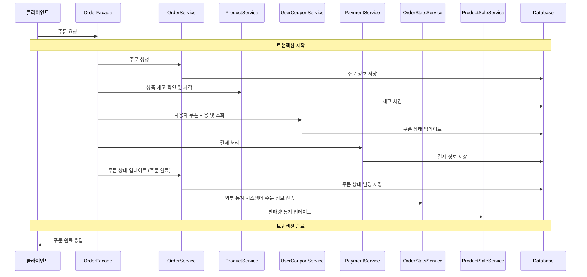
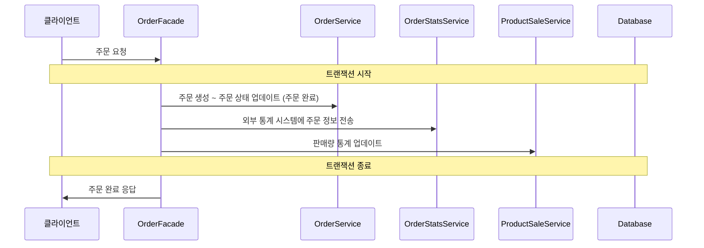

# 왜 ApplicationEvent를 사용하는가?
-`ApplicationEvent`와 `ApplicationListener` 인터페이스를 사용하면 애플리케이션 내에서 이벤트 기반 아키텍처를 구현할 수 있습니다. 이는 다음과 같은 장점을 제공합니다

1. **느슨한 결합**: 이벤트 발행자와 이벤트 수신자가 서로 직접 참조하지 않으므로, 컴포넌트 간의 결합도가 낮아집니다. 이는 유지보수성과 확장성을 향상시킵니다.
2. **비동기 처리**: 이벤트 리스너는 이벤트가 발생한 후
3. **확장성**: 새로운 이벤트 리스너를 추가하거나 기존 리스너를 수정하는 것이 비교적 쉽습니다. 이는 시스템이 성장하고 변화함에 따라 유연하게 대응할 수 있게 합니다.
4. **관심사의 분리**: 이벤트 발행과 이벤트 처리 로직을 분리하여 코드의 가독성과 관리성을 높입니다.

# 비즈니스 로직과 트랜잭션의 범위의 적절한 설정
- 비즈니스 로직은 일반적으로 하나의 트랜잭션 내에서 처리하는 것이 좋습니다. 이는 데이터 일관성을 유지하고, 부분적인 실패를 방지하기 위함입니다. 예를 들어, 쿠폰 발급과 관련된 모든 작업(재고 확인, 재고 차감, 사용자 쿠폰 생성 등)을 하나의 트랜잭션으로 묶으면, 중간에 실패하더라도 전체 작업이 롤백되어 데이터의 무결성을 유지할 수 있습니다.
- 하지만, 트랜잭션 범위를 너무 넓게 잡으면, 트랜잭션이 길어져서 데이터베이스 락이 오래 유지될 수 있고, 이는 성능 저하를 초래할 수 있습니다.
- 따라서, 트랜잭션 범위는 비즈니스 요구사항과 시스템 성능을 고려하여 적절히 조정해야 합니다.

## 트랜잭션 범위 문제 예시 1
- 트랜잭션 범위를 너무 넓게 잡은 경우
- 트랜잭션 내에서 여러 도메인 서비스가 사용됨에 따라
  - 하나라도 실패하면 전체 트랜잭션이 롤백됨
  - 트랜잭션이 길어져서 데드락 가능성 증가
  - 하나의 SlowRead로 인해 전체 성능 저하
- 예시 :
  - 기존 OrderFacade에서 모든 작업을 하나의 트랜잭션으로 처리

## 트랜잭션 범위 문제 예시 2
- 트랜잭션 범위 내에서 DB 와 무관한 작업을 수행하고 있는 경우(기존 OrderFacade 예시)
- 트랜잭션이 불필요하게 길어짐 IO 작업 등으로 인해 트랜잭션이 지연될 수 있음
- 예시
  - 기존 OrderFacade에서 외부 통계 시스템에 주문 정보 전송
  - 기존 OrderFacade에서 판매량 통계 업데이트

## 트랜잭션 범위 개선 방안
**Event 기반 흐름 제어**
- `Event` 를 발행 및 구독하는 모델링을 통해 코드의 강한 결합을 분리함
- `Event` 에 의해 본인의 관심사만 수행하도록 하여 비즈니스 로직간의 의존을 느슨하게 함

**활용 방안**
- 비대해진 트랜잭션 내의 각 작업을 작은 단위의 트랜잭션으로 분리할 수 있음
- 특정 작업이 완료되었을 때, 후속 작업이 이벤트에 의해 trigger 되도록 구성함으로써 과도하게 많은 비즈니스 로직을 알고 있을 필요 없음
- 트랜잭션 내에서 외부 API 호출 ( e.g. DB 작업 등 ) 의 실패나 수행이 주요 비즈니스 로직 ( 트랜잭션 ) 에 영향을 주지 않도록 구성할 수 있음

## 개선된 트랜잭션 범위 예시
- 외부 통계 시스템에 주문 정보 전송를 OrderFacade 트랜잭션 범위에서 분리
- OrderService에서 주문이 완료(changeCompleted)되었을 때, OrderSucceedEvent 발행
- ProductSaleService와 OrderStatsService가 OrderSucceedEvent를 구독하여, 주문 완료 후 별도의 트랜잭션으로 처리
