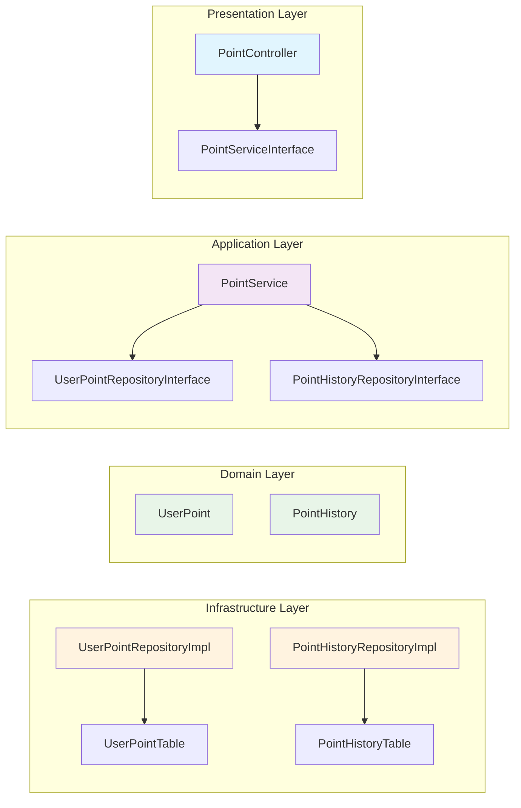
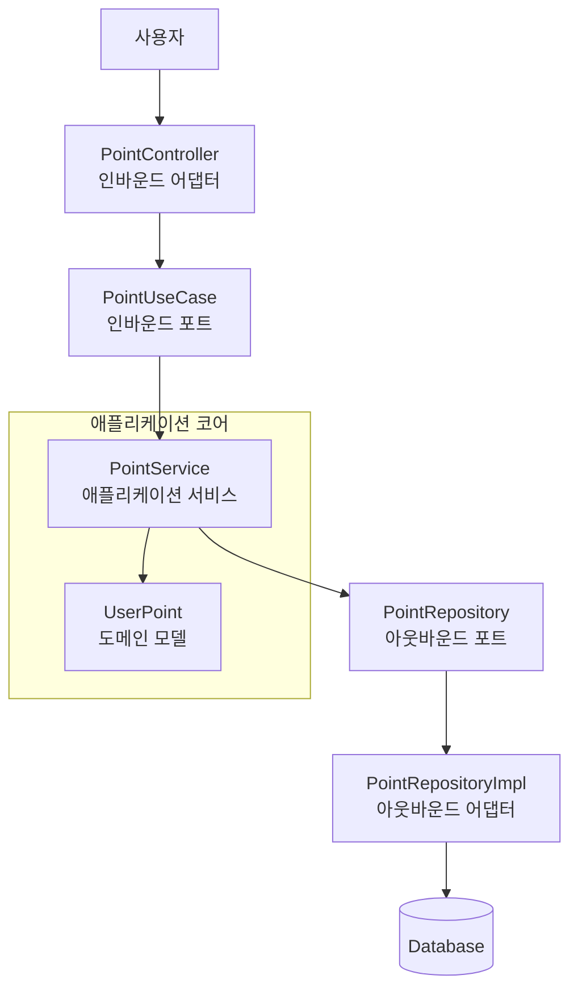

# 아키텍처 지식
## 🏛️ Clean Architecture 적용

### 아키텍처 특징
1. **레이어 분리**: Controller, Service, Domain, Infrastructure 레이어로 명확한 책임 분리
2. **의존성 역전**: `controller -> service -> (domain) -> infra` 순으로 상위에서 하위 계층으로 의존성이 필요한 구조에서 최대한 의존성 역전 원칙을 적용하여 상위 레이어가 하위 레이어에 직접 의존하지 않도록 설계
3. **테스트 용이성**: 각 레이어별 독립적인 테스트 가능
4. **변경 격리**: 외부 시스템 변경이 비즈니스 로직에 미치는 영향 최소화


### 패키지 구조 (유저 포인트 서비스 예시)
```
src/main/kotlin/tdd/
├── controller/          # 📡 외부 인터페이스 (Web Layer)
│   └── point/
│       ├── PointController.kt
│       └── PointServiceInterface.kt
├── point/
│   ├── service/         # 🔧 비즈니스 로직 (Application Layer)
│   │   └── PointService.kt
│   ├── domain/          # 🏛️ 핵심 비즈니스 규칙 (Domain Layer)
│   │   ├── UserPoint.kt
│   │   └── PointHistory.kt
│   └── repository/      # 📋 데이터 접근 인터페이스
│       ├── UserPointRepository.kt
│       └── PointHistoryRepository.kt
└── infra/              # 🔌 외부 시스템 연동 (Infrastructure Layer)
    └── point/
        ├── database/    # 데이터베이스 테이블
        └── persistence/ # Repository 구현체
```

### 각 레이어별 의존성 역전 원칙 적용
- **Controller**: `ServiceInterface` 에 의존하여 구체적인 서비스 계층에 의존하지 않음
- **Service**: `Repository` 인터페이스에 의존하여 인프라 계층에 의존하지 않음
- **Domain**: 외부 의존성 없는 도메인의 순수 비즈니스 로직
- **Infrastructure**: 도메인과 애플리케이션 레이어의 인터페이스를 구현, 외부 시스템과의 연동을 담당

## 📊 클린 아키텍처 다이어그램

### 전체 시스템 아키텍처 (유저 포인트 서비스 예시)


## 🏛️ 헥사고날 아키텍처

### 아키텍처 특징
1. **포트와 어댑터 패턴**: 비즈니스 로직(내부 육각형)을 외부 세계(외부 어댑터)로부터 격리
2. **육각형 구조**: 중심부의 도메인을 둘러싸는 6개의 면, 각 면은 다른 종류의 외부 연결을 나타냄
3. **방향성 없는 의존성**: 모든 의존성이 내부(도메인)를 향하도록 설계
4. **테스트 격리**: 외부 시스템 없이도 비즈니스 로직 테스트 가능
5. **유연한 확장**: 새로운 어댑터 추가로 쉬운 기능 확장

### 헥사고날 아키텍처 구성 요소
- **내부 육각형 (Domain Core)**: 비즈니스 로직과 도메인 모델
- **포트 (Port)**: 내부와 외부를 연결하는 인터페이스
  - **인바운드 포트(Driving Port)**: 애플리케이션을 사용하는 인터페이스 (UseCase, Service Interface)
  - **아웃바운드 포트(Driven Port)**: 애플리케이션이 사용하는 인터페이스 (Repository, 외부 API Interface)
- **어댑터 (Adapter)**: 포트를 구현하는 구체적인 클래스
  - **인바운드 어뎁터(Driving Adapter)**: 외부에서 애플리케이션을 호출 (Controller, Event Handler)
  - **아웃바운드 어뎁터(Driven Adapter)**: 애플리케이션이 외부를 호출 (Repository Impl, API Client)

### 패키지 구조 (유저 포인트 예시)
```
src/main/kotlin/tdd/point/
├── domain/                    # 애플리케이션 코어 (service, model)
│   ├── model/
│   │   ├── UserPoint.kt       # 도메인 모델
│   │   └── PointHistory.kt    # 도메인 모델
│   ├── service/
│   │   └── PointDomainService.kt  # 도메인 서비스
│   └── port/                  # 포트 인터페이스
│       ├── input/             # 인바운드 포트
│       │   ├── ChargePointUseCase.kt
│       │   ├── GetPointUseCase.kt
│       │   └── GetPointHistoryUseCase.kt
│       └── output/            # 아웃바운드 포트
│           ├── LoadPointPort.kt
│           ├── SavePointPort.kt
│           └── LoadPointHistoryPort.kt
├── application/               # 애플리케이션 서비스 (포트 구현)
│   └── service/
│       └── PointApplicationService.kt  # 인바운드 포트 구현
└── adapter/                   # 어댑터 (외부 연결)
    ├── input/                 # 인바운드 어뎁터 (Driving)
    │   └── web/
    │       ├── PointController.kt
    │       └── dto/
    │           ├── PointChargeRequest.kt
    │           └── PointResponse.kt
    └── output/                # 아웃바운드 어뎁터 (Driven)
        └── persistence/
            ├── PointPersistenceAdapter.kt  # 아웃바운드 포트 구현
            ├── entity/
            │   ├── UserPointEntity.kt
            │   └── PointHistoryEntity.kt
            └── repository/
                ├── UserPointJpaRepository.kt
                └── PointHistoryJpaRepository.kt
```

### 각 레이어별 의존성 역전 원칙 적용
- **인바운드 어뎁터 (Controller)**: 인바운드 포트(UseCase)에 의존하여 구체적인 애플리케이션 서비스에 의존하지 않음
- **Application Service**: Primary Port를 구현하고, Secondary Port에 의존하여 인프라 계층에 의존하지 않음
- **Domain**: 외부 의존성 없는 순수한 비즈니스 로직, 포트 인터페이스만 정의
- **아웃바운드 어뎁터**: Secondary Port를 구현하여 외부 시스템(DB, API 등)과 연동

### 포트와 어댑터 흐름
1. **Inbound Flow**: `Controller (인바운드 어뎁터) → UseCase (인바운드 포트) → Application Service → Domain`
2. **Outbound Flow**: `Application Service → Repository Port (아웃바운드 포트) → Repository Adapter (아웃바운드 어뎁터) → Database`

### 📊 헥사고날 아키텍처 다이어그램

### 전체 시스템 아키텍처 (유저 포인트 서비스 예시)


### 헥사고날 vs 클린 아키텍처 비교
| 구분 | 헥사고날 아키텍처 | 클린 아키텍처 |
|------|------------------|---------------|
| **구조** | 육각형 + 포트/어댑터 | 동심원 레이어 |
| **의존성 방향** | 모든 의존성이 내부로 | 외부 레이어에서 내부로 |
| **인터페이스** | 명시적 포트 정의 | 레이어간 인터페이스 |
| **외부 연결** | 어댑터를 통한 격리 | 레이어를 통한 격리 |
| **테스트** | 포트 모킹으로 격리 | 레이어별 독립 테스트 |
| **확장성** | 새 어댑터 추가 | 새 레이어/컴포넌트 추가 |
