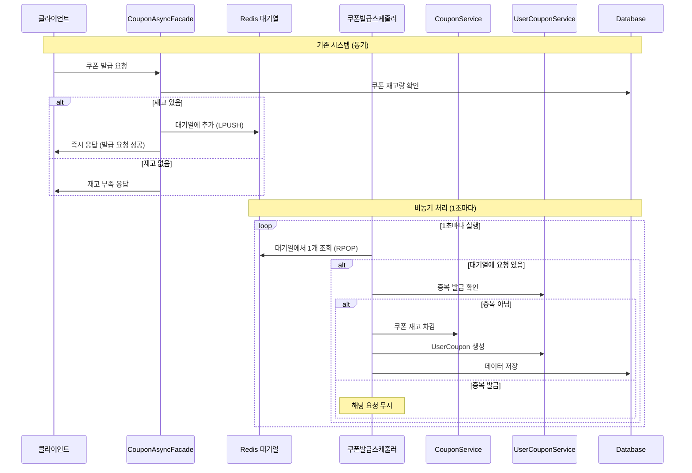

# 선착순 쿠폰 발급 절차 개선 (비동기 처리)

# 기존 선착순 쿠폰 발급 절차
## 로직
1. 발급 요청 즉시 동기적으로 쿠폰 발급 처리 및 완료 응답
## 단점
 - 동시 다발적인 발급 요청이 들어올 경우 DB에 과부하가 걸릴 수 있음
 - 발급 요청에 대한 응답이 느림

# 신규 선착순 쿠폰 발급 절차 (비동기 처리)
## 로직
1. 발급 요청에 대해 발급 요청 성공으로 즉시 응답완료한다.
    - 동시에 많은 발급 요청은 선착순으로 messageQ 에 넣어 놓기만 하고 빠른 응답 처리
2. 발급 요청에 대한 쿠폰 발급 처리는 비동기적으로 처리한다.
    - 실제 쿠폰 발급 처리는 messageQ에 쌓여있는 쿠폰 발급 요청들을 적절한 양만큼씩 처리하여, DB가 장애가 일어나지 않도록 한다.

## Redis를 이용한 대기열 사용 정의
- redis의 List 자료구조를 활용해서, messageQ로 활용
  - 대기열 추가시 LPUSH, 제거시 RPOP 이용
  - 대기열 키 : "coupon_issue_queue"
  - 대기열 값 : JSON 문자열
    - couponIssueRequestId
        - userId
        - couponId
        - timestamp

## 시퀀스 다이어그램

