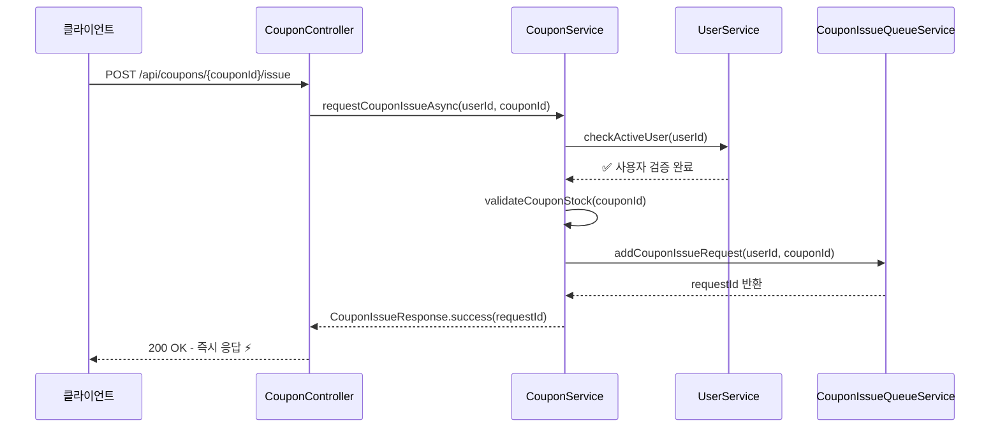
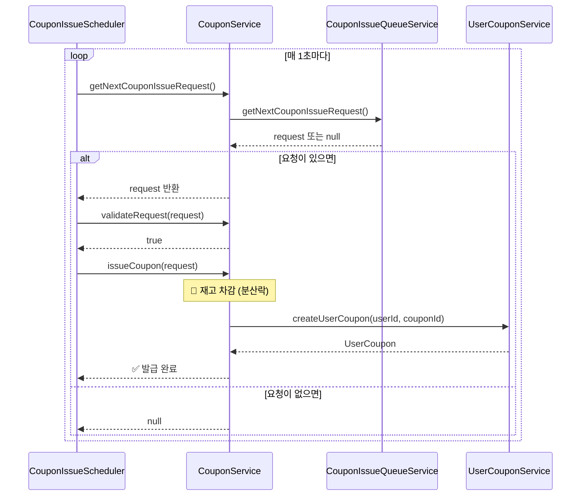

# 쿠폰 서비스 아키텍처 리팩토링 (CouponFacade 제거)

## 개요

기존 Facade 패턴을 제거하고 CouponService를 쿠폰 도메인의 단일 진입점으로 만드는 리팩토링을 진행합니다.
이를 통해 아키텍처를 단순화하고 응집도를 높이면서 불필요한 복잡성을 제거합니다.

## 기존 구조 (Before)

### 아키텍처 계층
```
Controller
    ↓
Facade (CouponFacade, CouponIssueFacade)
    ↓
Service (CouponService, UserCouponService, CouponIssueQueueService)
    ↓
Repository
```

### 구체적인 의존성
```kotlin
// Controller에서
class CouponController(
    private val couponFacade: CouponFacade,
)

// Scheduler에서
class CouponIssueScheduler(
    private val couponIssueQueueService: CouponIssueQueueService,
    private val couponIssueFacade: CouponIssueFacade,
)
```

### 기존 문제점
1. **낮은 응집도** - 쿠폰 관련 로직이 여러 클래스에 분산
2. **복잡한 테스트** - 여러 Facade와 Service를 Mock
3. **유지보수 어려움** - 변경 시 여러 계층에 영향

## 개선된 구조 (After)

### 아키텍처 계층
```
Controller/Scheduler
    ↓
CouponService (Single Entry Point)
    ↓
Internal Services (UserCouponService, CouponIssueQueueService)
    ↓
Repository
```

### 구체적인 의존성
```kotlin
// Controller에서
class CouponController(
    private val couponService: CouponServiceInterface, // 단일 의존성
)

// Scheduler에서
class CouponIssueScheduler(
    private val couponService: CouponServiceInterface, // 단일 의존성
)

// CouponService에서 (내부 의존성)
class CouponService(
    private val couponRepository: CouponRepository,
    private val userCouponService: UserCouponService,
    private val couponIssueQueueService: CouponIssueQueueServiceInterface,
    private val userService: UserServiceInterface,
    private val distributedLockManager: DistributedLockManagerInterface,
)
```

### 개선 효과

1. **단순화된 아키텍처** - 불필요한 Facade 계층 제거
2. **명확한 캡슐화** - CouponService가 쿠폰 도메인의 유일한 public interface
3. **향상된 응집도** - 모든 쿠폰 관련 로직이 CouponService에 집중

## 쿠폰 발급 시스템 플로우

### 1. 쿠폰 발급 요청 (비동기 - 즉시 응답)



### 2. 쿠폰 발급 처리 (백그라운드 - 실제 발급)



## 핵심 특징

### 🎯 **발급 요청 (Phase 1)**
- **목적**: 즉시 응답으로 사용자 경험 향상
- **처리**: 사용자 검증 → 재고 확인 → 대기열 추가
- **응답**: 성공/실패 즉시 반환

### 🔄 **발급 처리 (Phase 2)**
- **목적**: 안전한 실제 쿠폰 발급
- **처리**: 재고 차감 → 사용자 쿠폰 생성
- **특징**: 분산락으로 동시성 제어

### ✨ **아키텍처 장점**
- **분리된 관심사**: 요청 처리와 실제 발급 로직 분리
- **높은 처리량**: 즉시 응답으로 빠른 사용자 경험
- **안정성**: 백그라운드 처리로 DB 부하 분산
- **확장성**: Redis 대기열로 여러 서버 간 작업 분산

## 결론

이번 리팩토링을 통해 Clean Architecture의 원칙을 유지하면서도 과도한 추상화를 제거하여
실용적이고 유지보수하기 쉬운 아키텍처로 개선할 수 있습니다.
특히 쿠폰 도메인의 단일 진입점을 제공함으로써 도메인 응집도를 크게 향상시킬 수 있습니다.
