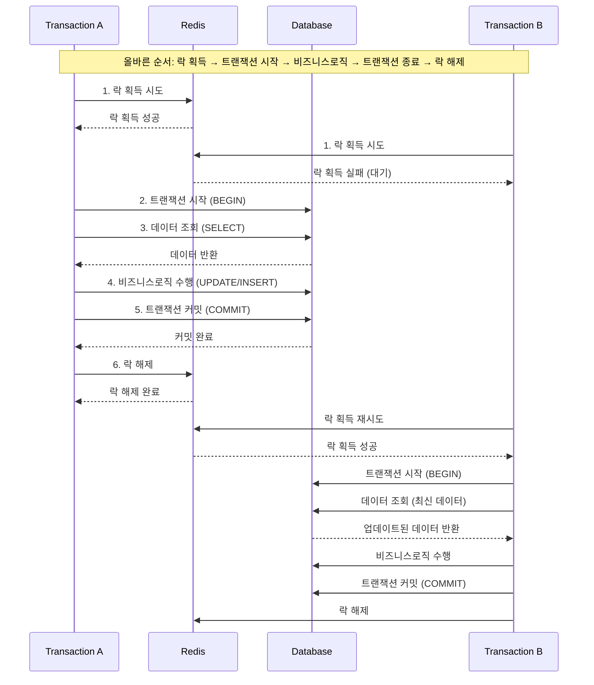
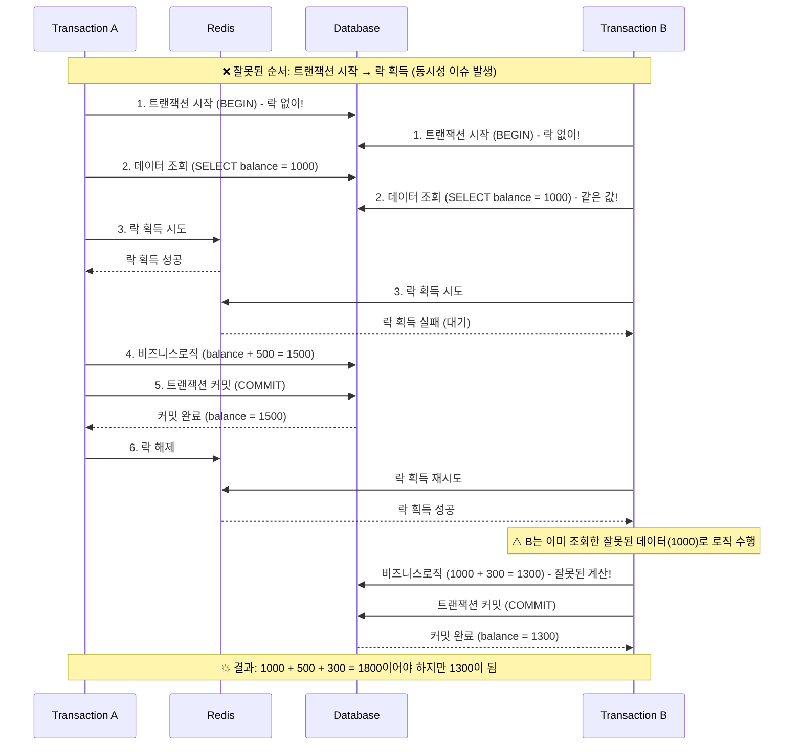
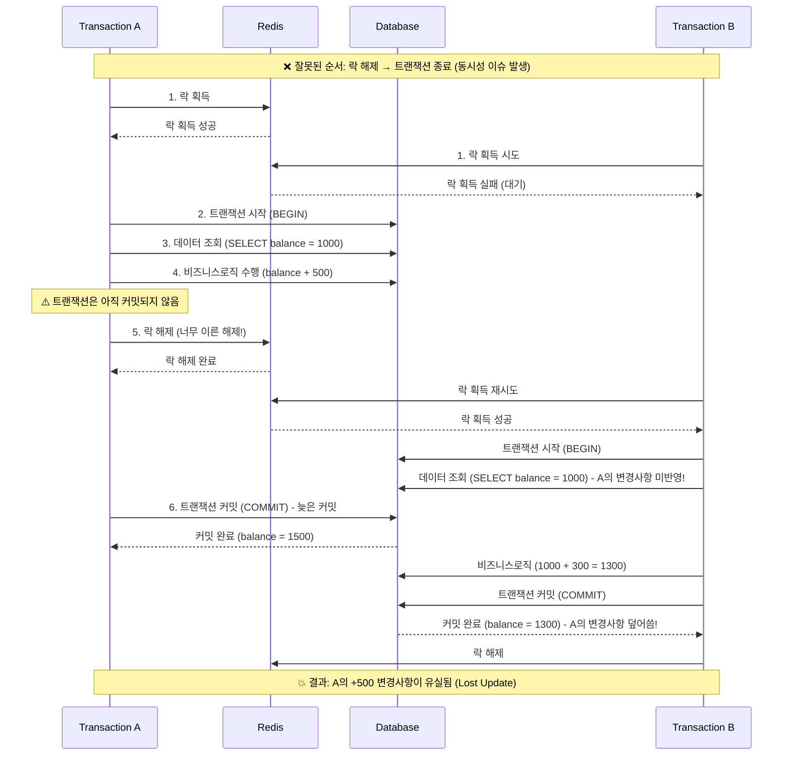

# 분산락 사용 이유
- DB 트랜잭션 이상의 범위, 분산 환경에서 Lock 을 적용할 수 있는 방법
- 다량의 트래픽을 처리하기 위해 적은 DB 부하로 올바르게 기능을 제공할 방법

# 분산락 이란?
- 여러 프로세스, 서버, 인스턴스에 걸쳐 자원에 대한 동시 접근을 제어하는 메커니즘
- 분산 시스템에서 데이터 일관성과 무결성을 유지하는 데 중요
- 예시: Redis 등을 활용한 분산
  - Redis 기반의 분산락
  - key-value 기반의 원자성을 이용한 Redis 를 통해 DB 부하를 최소화하는 Lock 을 설계

# 분산락 사용 시 고려사항
- Redis 락과 트랜잭션 동시 사용 시 주의
  - Redis 락은 DB 트랜잭션과 별개로 동작
  - 반드시 **락 획득 -> 트랜잭션 시작 -> 비즈니스로직 수행 -> 트랜잭션 종료 -> 락 해제 순서로 진행**
    - 만약 **트랜잭션 시작**이 **락 획득**보다 먼저라면, 다른 트랜잭션의 데이터 조회 + 수정이 가능해져서 동시성 이슈 발생
    - 만약 **트랜잭션 종료**가 **락 해제**보다 나중이라면, 락이 해제된 후 바로 다른 프로세스가 락을 획득하여 데이터 변경이 가능해져서 동시성 이슈 발생

## Redis 분산락과 트랜잭션 순서별 케이스 다이어그램

### (정상 유형) 올바른 락과 트랜잭션 순서
락 획득 → 트랜잭션 시작 → 비즈니스로직 수행 → 트랜잭션 종료 → 락 해제

### (문제 발생) 트랜잭션 시작이 락 획득보다 먼저
트랜잭션 시작 → 락 획득 → 비즈니스로직 수행 → 트랜잭션 종료 → 락 해제

### (문제 발생) 트랜잭션 종료가 락 해제보다 나중
락 획득 → 트랜잭션 시작 → 비즈니스로직 수행 → 락 해제 → 트랜잭션 종료

