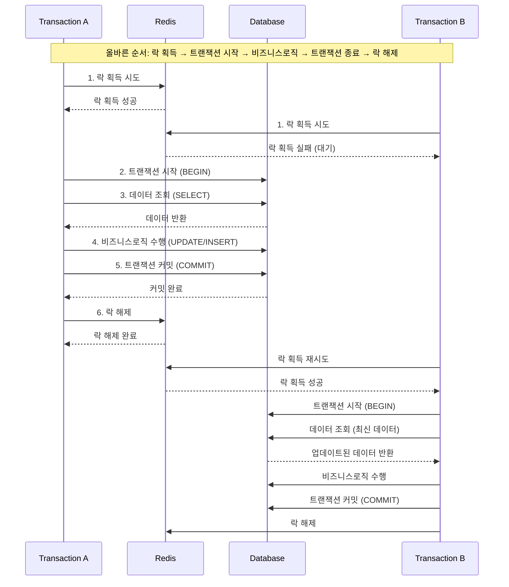
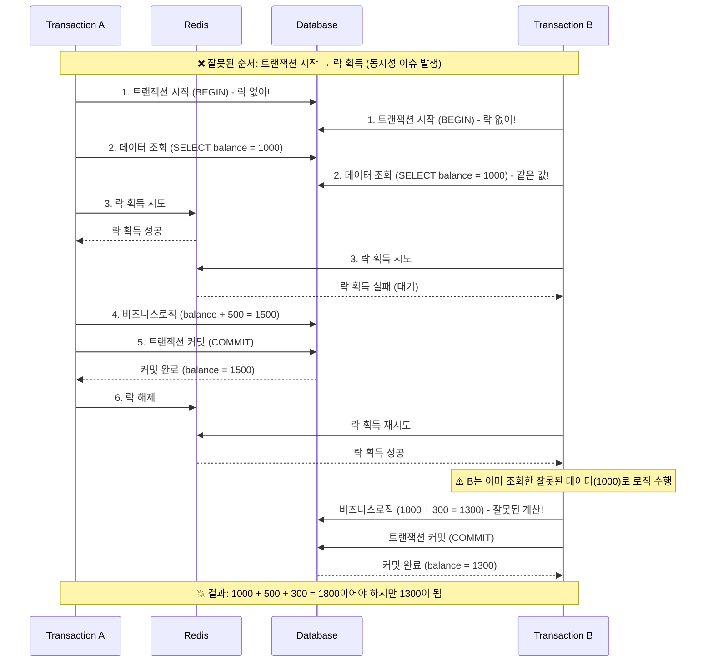
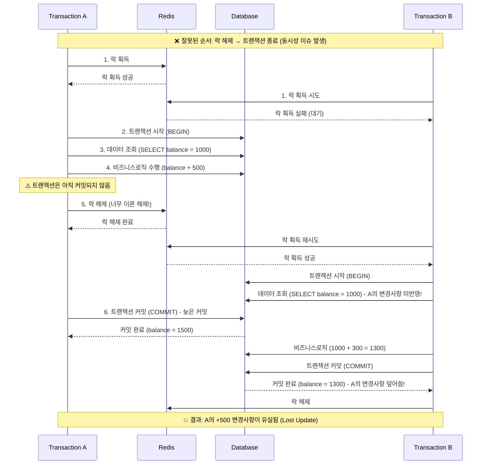

# 분산락 이란?
- 여러 프로세스, 서버, 인스턴스에 걸쳐 자원에 대한 동시 접근을 제어하는 메커니즘
- 분산 시스템에서 데이터 일관성과 무결성을 유지하는 데 중요
- 예시: Redis 등을 활용한 분산
  - Redis 기반의 분산락
  - key-value 기반의 원자성을 이용한 Redis 를 통해 DB 부하를 최소화하는 Lock 을 설계

## 분산락 사용 시 고려사항
- Redis 락과 트랜잭션 동시 사용 시 주의
  - Redis 락은 DB 트랜잭션과 별개로 동작
  - 반드시 **락 획득 -> 트랜잭션 시작 -> 비즈니스로직 수행 -> 트랜잭션 종료 -> 락 해제 순서로 진행**
    - 만약 **트랜잭션 시작**이 **락 획득**보다 먼저라면, 다른 트랜잭션의 데이터 조회 + 수정이 가능해져서 동시성 이슈 발생
    - 만약 **트랜잭션 종료**가 **락 해제**보다 나중이라면, 락이 해제된 후 바로 다른 프로세스가 락을 획득하여 데이터 변경이 가능해져서 동시성 이슈 발생
  - 따라서 분산락은 기본적으로 **새로운 트랜잭션**에서 사용하는 것을 권장
    - 따라서 요청에 대해서 기존 트랜잭션 + 새로운 트랜잭션으로 인해 두 번의 DB 커넥션이 발생할 수 있음 -> **커넥션 풀 사이즈를 충분히 확보해야 함**

## 분산락 적용과 미적용 케이스

### 분산락을 적용한 케이스
#### 선착순 쿠폰 발급 요청
- 쿠폰 발급은 짧은 시간에 수많은 사용자가 동시에 요청한다.
- 분산환경이 필요하며, 이때 분산락을 적용하여 DB IO 비용을 줄이고, 동시성 이슈를 방지하는 것이 효과적이다.

### 분산락을 적용하지 않은 케이스

#### 상품 재고 차감
- OrderFacade에서 상위 트랜잭션이 존재한다.
- DB 커넥션 풀이 충분히 확보되어 있지 않다면, 분산락을 위한 추가적인 트랜잭션을 만들 수 없는 상황이 발생할 수 있다.
- 따라서 기존대로 배타락을 사용하여 트랜잭션 범위 내에서 처리하는 것이 더 안전하다.

#### 사용자 포인트 사용 및 충전
- 상위 트랜잭션이 존재할 수 있다.(주문, 결제 등의 상황)
- DB 커넥션 풀이 충분히 확보되어 있지 않다면, 분산락을 위한 추가적인 트랜잭션을 만들 수 없는 상황이 발생할 수 있다.
- 따라서 기존대로 배타락을 사용하여 트랜잭션 범위 내에서 처리하는 것이 더 안전하다.

## Redis 분산락과 트랜잭션 순서에 따른 문제 사례

### (정상 유형) 올바른 락과 트랜잭션 순서
락 획득 → 트랜잭션 시작 → 비즈니스로직 수행 → 트랜잭션 종료 → 락 해제

### (문제 발생) 트랜잭션 시작이 락 획득보다 먼저
트랜잭션 시작 → 락 획득 → 비즈니스로직 수행 → 트랜잭션 종료 → 락 해제

### (문제 발생) 트랜잭션 종료가 락 해제보다 나중
락 획득 → 트랜잭션 시작 → 비즈니스로직 수행 → 락 해제 → 트랜잭션 종료

