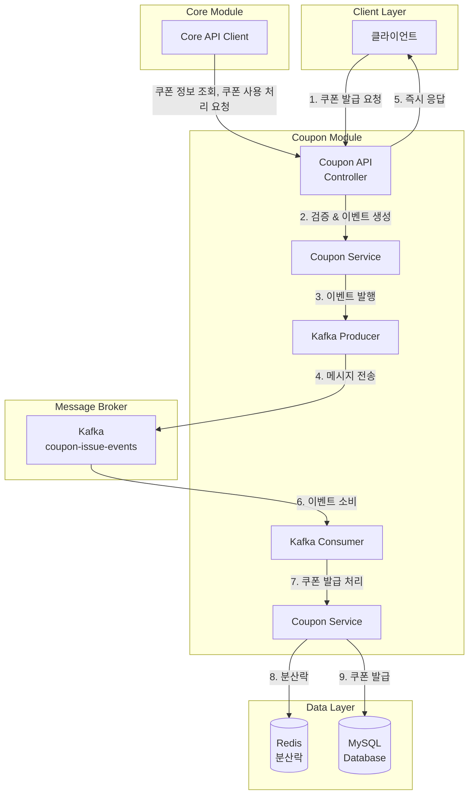
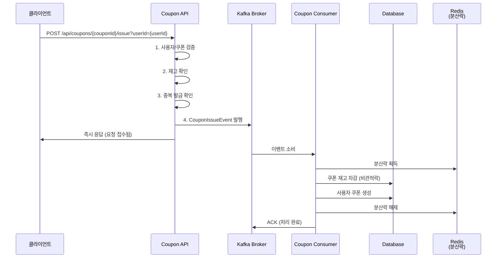
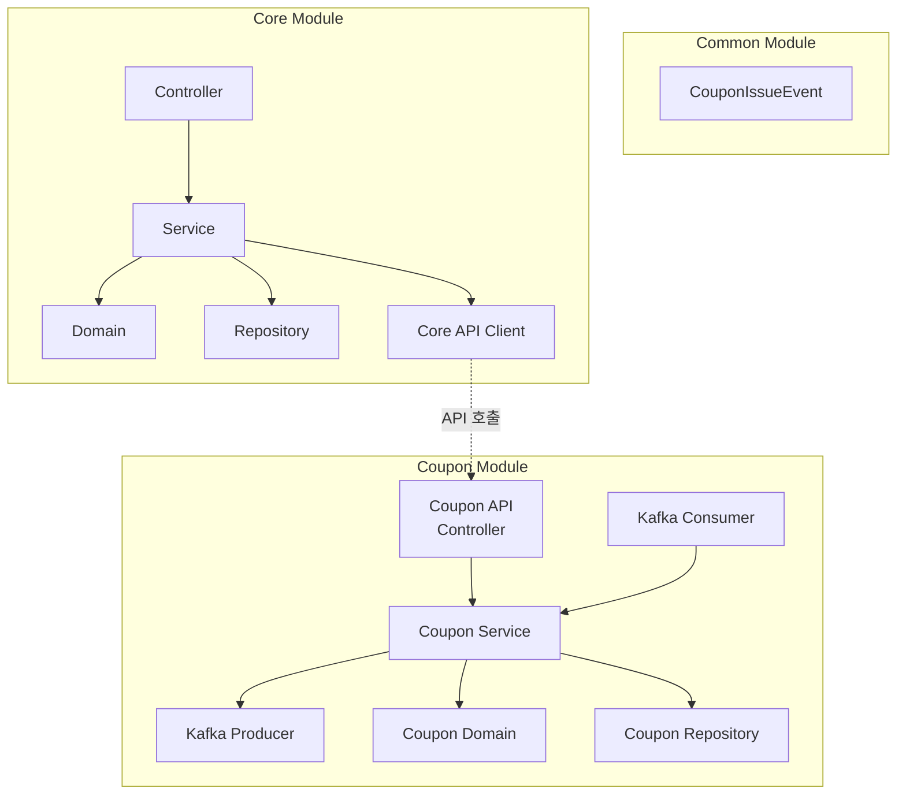

# Kafka 기반으로 선착순 쿠폰 발급 시스템 개선

## 📋 목차
1. 시스템 개요
2. 아키텍처
3. 멀티모듈 구조
4. Kafka Pub/Sub 구조
5. 결론

---

## 🎯 시스템 개요

기존 쿠폰 발급 시스템인 **쿠폰 발급 요청 즉시 발급 시스템(동기), 스케줄러 기반 쿠폰 발급 시스템(비동기)**에서
**Kafka 기반 이벤트 드리븐 아키텍처**로 개선한 시스템입니다.

### 주요 개선사항
- **비동기 처리**: 쿠폰 발급 요청과 처리 분리
- **높은 처리량**: Kafka의 고성능 메시징으로 대량 요청 처리
- **확장성**: Consumer 인스턴스 수평 확장 가능
- **순서 보장**: 파티션 키를 통한 쿠폰 종류별 순서 보장

---

## 🏗️ 아키텍처



### 처리 흐름



---

## 📦 멀티모듈 구조



### 모듈별 역할

#### 📦 Common Module
- **역할**: 공통 도메인 객체 및 이벤트 정의
- **구성요소**:
  - CouponIssueEvent (Kafka 이벤트)
  - 공통 도메인 객체
  - 공통 유틸리티

#### 🎯 Core Module
- **역할**: 주문, 결제, 포인트 등 핵심 비즈니스 로직
- **포트**: 8080
- **구성요소**:
  - REST API Controller (주문, 결제, 포인트)
  - 비즈니스 로직 서비스
  - Core API Client (쿠폰 서비스 호출용)
  - Repository 계층

#### 🔄 Coupon Module (Publisher + Consumer)
- **역할**: 쿠폰 관련 모든 기능 (API, Producer, Consumer)
- **포트**: 8081
- **구성요소**:
  - Coupon API Controller (쿠폰 발급, 조회, 사용)
  - Coupon Service (비즈니스 로직)
  - Kafka Producer (이벤트 발행)
  - Kafka Consumer (이벤트 소비)
  - 쿠폰 도메인 및 Repository

---

## 🔄 Kafka Pub/Sub 구조

### 핵심 특징

#### 1. 순서 보장
- **파티션 키 활용**: `coupon-{couponId}` 형식으로 쿠폰별 파티셔닝
- **같은 쿠폰 요청**: 항상 같은 파티션으로 라우팅되어 순서 보장

#### 2. 동시성 제어
- **분산락**: Redis 기반 분산락으로 쿠폰별 동시성 제어
- **비관적 락**: 데이터베이스 레벨 락으로 재고 정합성 보장

#### 3. Coupon 인스턴스 확장
```bash
# 여러 Coupon 인스턴스 실행 (수평 확장)
./gradlew :coupon:bootRun --args='--server.port=8082'
./gradlew :coupon:bootRun --args='--server.port=8083'
```

---

## 📝 결론

Kafka 기반 쿠폰 발급 시스템은 **Coupon 모듈에서 모든 쿠폰 관련 기능을 전체를 책임**을 갖도록 하였습니다.

### **현재 아키텍처의 특징**
- **이벤트 드리븐 아키텍처**: 비동기 메시징으로 높은 처리량과 확장성 확보
- **높은 응집도**: 쿠폰 관련 모든 로직이 한 모듈에 집중

### **시스템 장점**
- **높은 처리량**: 초당 수천 건의 요청 처리 가능
- **즉시 응답**: 사용자에게 빠른 피드백 제공
- **확장성**: Coupon 애플리케이션 인스턴스 수평 확장으로 처리량 증대
- **내결함성**: 메시지 재처리를 통한 안정성 확보
- **순서 보장**: 파티션 키를 통한 쿠폰별 순서 처리
- **유지보수성**: 쿠폰 관련 모든 코드가 한 모듈에 집중

이러한 아키텍처를 통해 대규모 트래픽 상황에서도 안정적이고 효율적인 쿠폰 발급 서비스를 제공할 수 있습니다.
