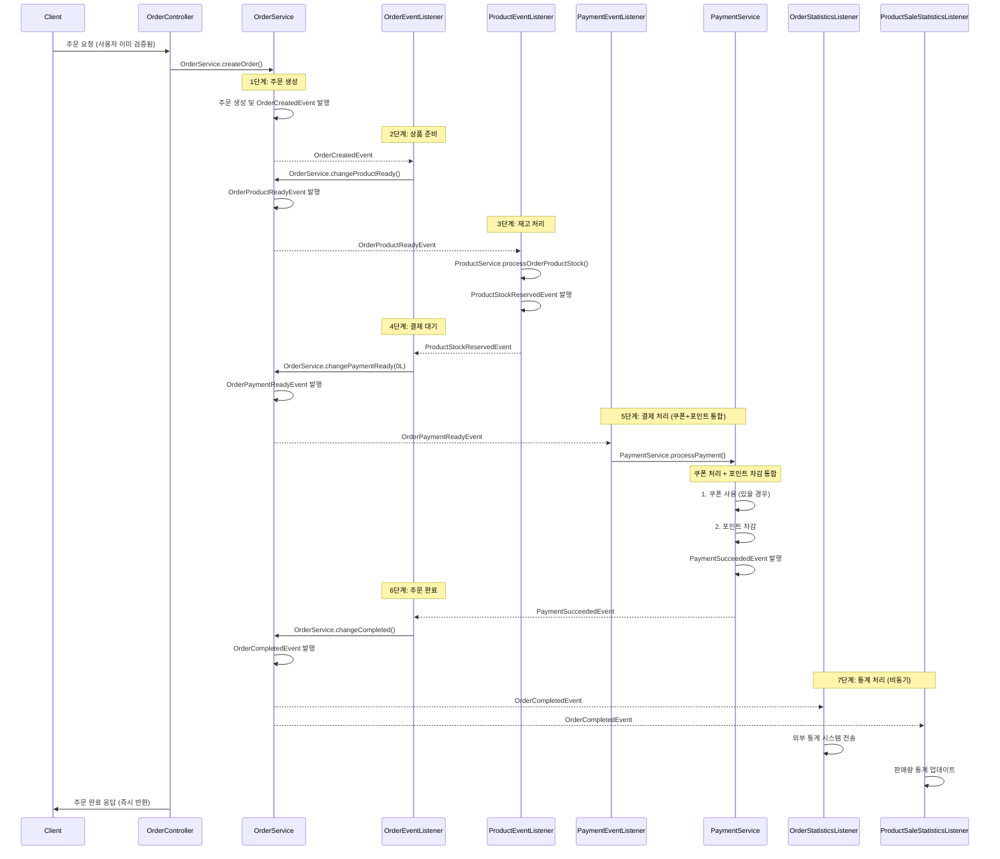
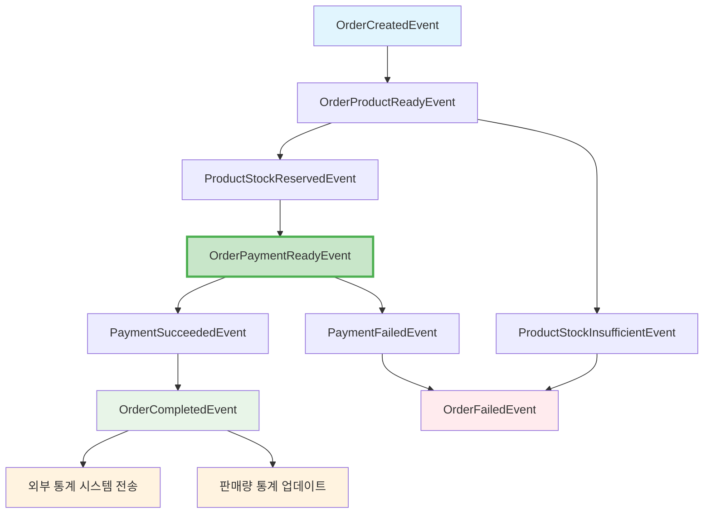
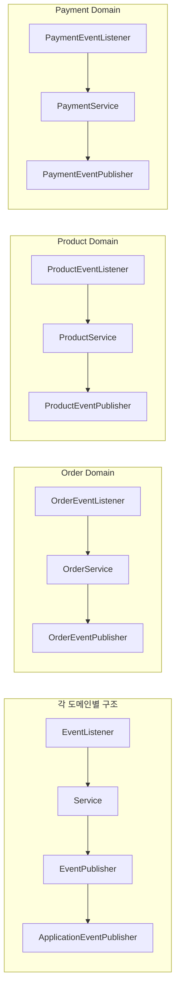

# Event-Driven Architecture 서비스 설계 문서

## 1. Facade 패턴에서 Event-Driven 패턴으로의 전환

### 1.1 제거된 파일
- **`OrderFacade.kt` - 제거됨**

### 1.2 구현 완료된 파일들
- `OrderEventListener.kt` - 주문 상태 변경 이벤트 처리
- `ProductEventListener.kt` - 상품 재고 처리 이벤트 처리
- `PaymentEventListener.kt` - 결제 처리 이벤트 처리
- `OrderStatisticsEventListener.kt` - 외부 통계 시스템 전송 처리
- `ProductSaleStatisticsEventListener.kt` - 판매량 통계 업데이트 처리
- `OrderEventPublisher.kt` - 주문 도메인 이벤트 발행
- `ProductEventPublisher.kt` - 상품 도메인 이벤트 발행
- `PaymentEventPublisher.kt` - 결제 도메인 이벤트 발행


### 1.3 기존 Facade 패턴의 문제점

**현재 OrderFacade.processOrder()의 단일 트랜잭션 처리:**
```kotlin
@Transactional
fun processOrder(orderCriteria: OrderCriteria): Order {
    // 1. 유저 검증 (MSA 환경에서는 공통화되므로 제거 예정)
    // 2. 주문 생성
    // 3. 상품 준비중 상태로 변경
    // 4. 상품 재고 확인 및 차감
    // 5. 쿠폰 사용 처리
    // 6. 결제 대기 상태로 변경
    // 7. 결제 처리
    // 8. 결제 성공 상태로 변경
    // 9. 주문 완료 상태로 변경
    // 10. 외부 통계 시스템에 주문 정보 전송(이벤트 발행)
    // 11. 판매량 통계 업데이트(이벤트 발행)
}
```

**문제점:**
- 모든 도메인 서비스가 하나의 트랜잭션에 묶임
- 하나의 서비스 실패 시 전체 롤백
- 도메인 간 강한 결합
- MSA 환경에서 분산 트랜잭션 문제

### 1.4 쿠폰 처리 구조 개선

#### **문제점:**
1. **도메인 분리의 부자연스러움**: 쿠폰 처리 후 할인금액 계산하여 결제 처리 진행
2. **비즈니스 로직의 분산**: 결제 관련 로직이 여러 곳에 흩어짐

#### 개선된 구조
```
ProductStockReservedEvent
    ↓ (OrderEventListener)
OrderService.changePaymentReady(0L) // 할인 금액은 PaymentService에서 계산
    ↓ (OrderEventPublisher)
OrderPaymentReadyEvent
    ↓ (PaymentEventListener)
PaymentService.processPayment() - 쿠폰 + 포인트 통합 처리
    ↓ (PaymentEventPublisher)
PaymentSucceededEvent
```

**개선점:**
1. **자연스러운 비즈니스 플로우**: 결제할 때 쿠폰과 포인트를 함께 처리
2. **도메인 책임 명확화**: Payment Domain이 모든 결제 관련 로직 담당

#### PaymentService에 쿠폰 처리 통합 이유

**💡 핵심 아키텍처 결정 배경:**

1. **현실적인 비즈니스 플로우**
   - 실제 결제 시 쿠폰과 포인트를 함께 처리하는 것이 자연스러움
   - 고객 관점: "결제할 때 쿠폰 적용"이 일반적인 UX

2. **트랜잭션 경계의 명확성**
   - 쿠폰 사용과 포인트 차감이 하나의 원자적 연산
   - 실패 시 함께 롤백되어야 하는 논리적 단위

3. **도메인 책임 재정의**
   - **Coupon Domain**: 쿠폰 정보 관리, 유효성 검증
   - **Payment Domain**: 결제 프로세스 전체 (쿠폰 적용 + 포인트 차감)

4. **MSA 관점에서의 서비스 응집도**
   - 결제 서비스에서 모든 결제 수단을 통합 관리
   - 향후 다양한 결제 수단 추가 시 확장성 확보

### 1.5 Event-Driven으로 전환된 아키텍처 특징

**Listener → Service → Publisher 구조 적용:**
- **Listener**: 이벤트 수신 및 Service 호출
- **Service**: 기존 비즈니스 로직 처리 (재사용)
- **Publisher**: 도메인별 이벤트 발행 인터페이스

**트랜잭션 분리:**
- **주문 요청 시작**: Controller → OrderService (독립 트랜잭션)
- **각 단계별 처리**: 각 도메인 서비스별 독립 트랜잭션
- **이벤트 연결**: Spring ApplicationEvent로 단계별 연결
- **보상 트랜잭션**: 실패 시 독립적인 보상 처리

**MSA 환경 준비:**
- **사용자 검증 제거**: MSA에서는 API Gateway에서 처리
- **도메인별 Publisher 인터페이스**: 향후 FeignClient로 교체 가능

## 2. Event-Driven 주문 처리 흐름 설계

### 2.1 실제 구현된 이벤트 플로우



### 2.2 도메인별 이벤트 정의

#### Order Domain Events
```kotlin
// 주문 생성 완료
data class OrderCreatedEvent(
    val orderId: Long,
    val userId: Long,
    val orderItems: List<OrderItemData>,
    val usedCouponId: Long?
)

// 주문 상품 준비 완료
data class OrderProductReadyEvent(
    val orderId: Long,
    val userId: Long,
    val orderItems: List<OrderItemData>
)

// 주문 결제 대기 상태
data class OrderPaymentReadyEvent(
    val orderId: Long,
    val userId: Long,
    val totalAmount: Long,
    val usedCouponId: Long?
)

// 주문 완료
data class OrderCompletedEvent(
    val orderId: Long,
    val userId: Long,
    val totalAmount: Long,
    val orderItems: List<OrderItemData>
)

// 주문 실패
data class OrderFailedEvent(
    val orderId: Long,
    val failureReason: String,
    val failedStep: String
)

// 외부 통계 시스템 전송 요청
data class OrderStatisticsRequestedEvent(
    val orderId: Long,
    val userId: Long,
    val totalAmount: Long,
    val orderItems: List<OrderItemEventData>
)
```

#### User Domain Events
```kotlin
// MSA 환경에서는 사용자가 이미 검증된 상태로 요청이 옵니다.
// 따라서 별도의 사용자 검증 이벤트는 제거하였습니다.
// API Gateway나 Auth Service에서 인증/인가를 처리합니다.
```

#### Product Domain Events
```kotlin
// 재고 확보 성공
data class ProductStockReservedEvent(
    val orderId: Long,
    val products: List<ProductReservationData>
)

// 재고 부족
data class ProductStockInsufficientEvent(
    val orderId: Long,
    val insufficientProducts: List<ProductInsufficientData>,
    val reason: String
)
```

#### Coupon Domain Events
```kotlin
// 쿠폰 처리는 PaymentService.processPayment() 내부에서 직접 처리
```

#### Payment Domain Events
```kotlin
// 결제 성공
data class PaymentSucceededEvent(
    val orderId: Long,
    val paymentId: Long,
    val finalAmount: Long
)

// 결제 실패 (재고 복구용 데이터 포함)
data class PaymentFailedEvent(
    val orderId: Long,
    val paymentId: Long,
    val failureReason: String,
    val orderItems: List<OrderItemCommand> // 🆕 재고 복구용 주문 상품 데이터
)
```

### 2.2 실제 구현된 이벤트 관계도



### 2.3 Listener → Service → Publisher 구조



## 3. 실제 구현된 Event-Driven 아키텍처

### 3.1 완전한 이벤트 플로우 정리

```
OrderCreatedEvent
    ↓ (OrderEventListener)
OrderService.changeProductReady()
    ↓ (OrderEventPublisher)
OrderProductReadyEvent
    ↓ (ProductEventListener)
ProductService.processOrderProductStock()
    ↓ (ProductEventPublisher)
ProductStockReservedEvent
    ↓ (OrderEventListener)
OrderService.changePaymentReady(0L)
    ↓ (OrderEventPublisher)
OrderPaymentReadyEvent
    ↓ (PaymentEventListener)
PaymentService.processPayment() - 쿠폰 + 포인트 통합 처리
    ↓ (PaymentEventPublisher)
PaymentSucceededEvent
    ↓ (OrderEventListener)
OrderService.changeCompleted()
    ↓ (OrderEventPublisher)
OrderCompletedEvent
    ↓ (OrderStatisticsEventListener + ProductSaleStatisticsEventListener)
                   외부 통계 시스템 전송 + 판매량 통계 업데이트
```


## 4. 보상 트랜잭션(Compensation) 구현 - 개선된 버전

### 4.1 결제 실패 시 보상 로직 개선

**🔄 기존 문제점:**
- 동기적 재고 복구로 인한 트랜잭션 문제
- 재고 복구 실패 시 결제 실패 기록도 롤백되는 위험
- 성능상 블로킹 이슈

**✅ 개선된 구조:**
- **이벤트 기반 비동기 보상**: `PaymentFailedEvent`에 `orderItems` 포함
- **트랜잭션 격리**: `PaymentEventListener`에서 별도 트랜잭션으로 재고 복구
- **장애 격리**: 재고 복구 실패가 결제 처리에 영향 없음

### 4.2 개선된 보상 트랜잭션 플로우

```kotlin
// 1. PaymentService에서 실패 시 이벤트 발행
catch (e: Exception) {
    val payment = Payment.createPayment(originalAmount, 0L)
    payment.fail()
    val savedPayment = paymentRepository.save(payment)

    // 🆕 재고 복구용 데이터를 포함한 실패 이벤트 발행
    paymentEventPublisher.publishPaymentFailed(
        orderId = command.order.orderId,
        paymentId = savedPayment.paymentId,
        failureReason = e.message ?: "Payment failed",
        orderItems = command.order.orderItems.map {
            OrderItemCommand(it.productId, it.quantity)
        }
    )
    throw e
}

// 2. PaymentEventListener에서 비동기 재고 복구
@Async
@TransactionalEventListener(phase = TransactionPhase.AFTER_COMMIT)
fun handlePaymentFailedStockRestore(event: PaymentFailedEvent) {
    try {
        // 별도 트랜잭션에서 재고 복구
        productService.restoreStock(event.orderItems)
    } catch (e: Exception) {
        // 재고 복구 실패는 별도 처리 (알림/모니터링)
        log.error("재고 복구 실패 - 데이터 정합성 이슈 발생")
    }
}
```

## 5. EventListener 트랜잭션 관리

### 5.1 Event-Driven 아키텍처에서의 트랜잭션 전략

#### 각 도메인별 트랜잭션 독립성 보장

⚠️ **핵심 원칙**:

## Event-Driven에서 @EventListener vs @TransactionalEventListener 사용 규칙

### 1️⃣ @TransactionalEventListener + @Async
- @TransactionalEventListener는 @Transactional과 함께 사용 금지
  - 이유 : @TransactionalEventListener는 이미 트랜잭션 경계 내에서 호출되므로 중복
- @Async와 함께 사용하여 독립 트랜잭션 보장
```kotlin
// ✅ 표준 패턴: 모든 비즈니스 로직 처리
@Async
@TransactionalEventListener(phase = TransactionPhase.AFTER_COMMIT)
fun handleBusinessEvent(event: DomainEvent) {
    // 비즈니스 로직 처리
}
```

### 2️⃣ @EventListener (특별한 용도만)
```kotlin
// ✅ 즉시 동기적 처리가 필요한 경우만 사용
@EventListener
fun handleImmediateAction(event: DomainEvent) {
}
```

#### TransactionPhase 옵션 선택 기준
| Phase | 실행 시점 | 특징 | 사용 사례 |
|-------|-----------|------|-----------|
| `BEFORE_COMMIT` | 트랜잭션 커밋 직전 | - 메인 트랜잭션과 같은 트랜잭션<br>- 이벤트 처리 실패 시 전체 롤백 | - 필수적인 데이터 일관성 유지<br>- 동기적 처리가 필요한 경우 |
| `AFTER_COMMIT` | 트랜잭션 커밋 후 | - 새로운 트랜잭션<br>- 메인 로직과 분리<br>- 실패해도 메인 트랜잭션 영향 없음 | - 외부 시스템 연동<br>- 통계 데이터 처리<br>- 알림 발송 |
| `AFTER_ROLLBACK` | 트랜잭션 롤백 후 | - 메인 트랜잭션 실패 시에만 실행 | - 실패 알림<br>- 로깅<br>- 모니터링 |
| `AFTER_COMPLETION` | 트랜잭션 완료 후 | - 성공/실패 관계없이 실행 | - 리소스 정리<br>- 감사 로그 |

### 5.3 Spring Transaction 전파 옵션
- 물리적 트랜잭션과 논리적 트랜잭션을 다룰 수 있는 다양한 전파 옵션 제공

```kotlin
enum class Propagation {
    REQUIRED,        // 트랜잭션이 있으면 참여, 없으면 새로 생성 (기본값)
    SUPPORTS,        // 트랜잭션이 있으면 참여, 없으면 트랜잭션 없이 실행
    MANDATORY,       // 반드시 트랜잭션 내에서 실행, 없으면 예외
    REQUIRES_NEW,    // 항상 새로운 트랜잭션 생성 (기존 트랜잭션 일시 중단)
    NOT_SUPPORTED,   // 트랜잭션 없이 실행 (기존 트랜잭션 일시 중단)
    NEVER,          // 트랜잭션 없이 실행, 트랜잭션이 있으면 예외
    NESTED          // 중첩 트랜잭션 (savepoint 사용)(기존 트랜잭션 있다면, savepoint 생성)(없다면 새로 생성)
}
```

#### 실제 구현 예시
```kotlin
@Component
class EventDrivenTransactionExamples {

    // 1. 도메인 로직 처리: @Async + 독립 트랜잭션
    @Async
    @TransactionalEventListener(phase = TransactionPhase.AFTER_COMMIT)
    fun handleBusinessLogic(event: UserValidatedEvent) {
        orderService.changeToProductReady(event.orderId)
    }

    // 2. 로깅/모니터링: 트랜잭션 없음 (빠른 처리)
    @TransactionalEventListener(phase = TransactionPhase.AFTER_COMPLETION)
    fun handleLogging(event: OrderFailedEvent) {
        logger.error("주문 실패: ${event.orderId}, 사유: ${event.failureReason}")
    }

    // 3. 보상 트랜잭션: @Async + 독립 트랜잭션
    @Async
    @TransactionalEventListener(phase = TransactionPhase.AFTER_COMMIT)
    fun handleCompensation(event: PaymentFailedEvent) {
        compensationService.startCompensation(event.orderId)
    }
}
```

## 6. @Async 사용을 위한 설정

### 6.1 Application에서 @EnableAsync 설정

```kotlin
@SpringBootApplication
@EnableAsync
class ServerApplication

fun main(args: Array<String>) {
    runApplication<ServerApplication>(*args)
}
```


### 6.2 중요한 주의사항

⚠️ **@Async + @TransactionalEventListener 사용 시 고려사항:**

1. **스레드 독립성**: 각 이벤트 처리가 새로운 스레드에서 실행
2. **트랜잭션 독립성**: `REQUIRES_NEW`로 완전히 새로운 트랜잭션 생성
3. **예외 처리**: 비동기에서 발생한 예외는 호출자에게 전파되지 않음
4. **순서 보장**: 비동기 처리로 인해 이벤트 처리 순서 보장 안됨

```kotlin
// ✅ 올바른 패턴
@Async
@TransactionalEventListener(phase = TransactionPhase.AFTER_COMMIT)
@Transactional(propagation = Propagation.REQUIRES_NEW)
fun handleEvent(event: DomainEvent) {
    try {
        // 비즈니스 로직 처리
        businessLogic(event)
    } catch (e: Exception) {
        // 예외 처리 필수 (호출자에게 전파 안됨)
        logger.error("이벤트 처리 실패", e)
        // 필요시 보상 트랜잭션 발행
    }
}
```

## 7. DomainEvent 공통 인터페이스

### 7.1 DomainEvent 추상 클래스 정의

```kotlin
/**
 * 모든 도메인 이벤트의 상위 추상 클래스
 * 간단하게 자동 생성되는 eventId만 포함
 */
abstract class DomainEvent {
    val eventId: String = UUID.randomUUID().toString()
}
```

### 7.2 이벤트 클래스들은 DomainEvent 상속 필수

#### Order Domain Events
```kotlin
// 주문 생성 완료
data class OrderCreatedEvent(
    val orderId: Long,
    val userId: Long,
    val orderItems: List<OrderItemData>,
    val usedCouponId: Long?
) : DomainEvent()

// 주문 완료
data class OrderCompletedEvent(
    val orderId: Long,
    val userId: Long,
    val totalAmount: Long,
    val orderItems: List<OrderItemData>
) : DomainEvent()

// 주문 실패
data class OrderFailedEvent(
    val orderId: Long,
    val failureReason: String,
    val failedStep: String
) : DomainEvent()
```

#### Payment Domain Events
```kotlin
// 결제 성공
data class PaymentSucceededEvent(
    val orderId: Long,
    val paymentId: Long,
    val finalAmount: Long
) : DomainEvent()

// 결제 실패 (재고 복구용 데이터 포함)
data class PaymentFailedEvent(
    val orderId: Long,
    val paymentId: Long,
    val failureReason: String,
    val orderItems: List<OrderItemCommand> // 🆕 재고 복구용 주문 상품 데이터
) : DomainEvent()
```

### 7.3 이벤트 모니터링

```kotlin
@Component
class EventProcessingMonitor {
    private val log = LoggerFactory.getLogger(EventProcessingMonitor::class.java)

    // ✅ 이벤트 발행 즉시 로그 기록
    @EventListener
    fun recordEventProcessing(event: DomainEvent) {
        log.info(
            "이벤트 발행: ${event.javaClass.simpleName}, " +
            "이벤트 ID: ${event.eventId}"
        )
    }
}
```


## 8. Event-Driven 아키텍처의 장점과 고려사항

### 9.1 장점
1. **도메인 독립성**: 각 도메인이 독립적인 트랜잭션으로 처리
2. **확장성**: 새로운 도메인 추가 시 기존 코드 변경 없음
3. **장애 격리**: 한 도메인의 실패가 다른 도메인에 영향 없음
4. **MSA 준비**: 각 도메인별 독립 배포 준비 완료
5. **테스트 용이성**: 각 이벤트별 독립적인 테스트 가능
6. **Listener → Service → Publisher 구조**: 기존 비즈니스 로직 재사용
7. **인터페이스 분리**: 향후 FeignClient로 쉽게 교체 가능

## 9. 결론

### 9.1 구현 완료된 Event-Driven 아키텍처

1. **OrderFacade 제거 완료**: 단일 트랜잭션 문제 해결 ✅
2. **완전한 Listener → Service → Publisher 구조 적용**: 모든 도메인에 일관되게 적용 ✅
3. **ApplicationEventPublisher 직접 의존성 제거**: 모든 EventListener에서 제거 완료 ✅
4. **도메인별 독립적인 처리**: 각 도메인 서비스별 독립 트랜잭션 ✅
5. **MSA 환경 준비**: 사용자 검증 제거, 인터페이스 분리 ✅
6. **통계 처리 분리**: 외부 통계, 판매량 통계 독립 처리 ✅
7. **실패 처리 일관성**: 모든 실패 케이스에서 Service를 통한 이벤트 발행 ✅
8. **쿠폰 처리 구조 개선**: PaymentService로 통합, 자연스러운 비즈니스 플로우 ✅
9. **🆕 보상 트랜잭션 개선**: 동기적 재고 복구를 이벤트 기반 비동기 처리로 변경 ✅

### 9.2 실제 구현된 이벤트 플로우

```
Client → OrderController → OrderService.createOrder()
    ↓ (OrderCreatedEvent)
OrderEventListener → OrderService.changeProductReady()
    ↓ (OrderProductReadyEvent)
ProductEventListener → ProductService.processOrderProductStock()
    ↓ (ProductStockReservedEvent)
OrderEventListener → OrderService.changePaymentReady(0L)
    ↓ (OrderPaymentReadyEvent)
PaymentEventListener → PaymentService.processPayment() [쿠폰+포인트 통합]
    ↓ (PaymentSucceededEvent)
OrderEventListener → OrderService.changeCompleted()
    ↓ (OrderCompletedEvent)
OrderStatisticsEventListener + ProductSaleStatisticsEventListener
    ↓
외부 통계 시스템 전송 + 판매량 통계 업데이트
```

**🚀 핵심 개선사항:**
- **이벤트 단순화**: 7단계 → 6단계 (쿠폰 이벤트 제거)
- **비즈니스 로직 통합**: PaymentService에서 쿠폰+포인트 통합 처리
- **자연스러운 플로우**: 결제할 때 쿠폰 적용하는 현실적인 구조
- **🆕 보상 로직 개선**: 동기적 재고 복구 → 이벤트 기반 비동기 보상으로 변경

### 9.3 향후 MSA 전환 준비

- **EventPublisher 인터페이스**: FeignClient로 교체 가능
- **Cross-domain 조회 최소화**: 이벤트에 필요한 데이터 포함
- **도메인별 독립성**: 서비스 분리 시 최소 변경
- **장애 격리**: 한 도메인 실패가 다른 도메인에 영향 없음

이 설계를 통해 현재 모놀리스 환경에서도 도메인별 독립성을 확보하고, 향후 MSA 전환 시에도 최소한의 변경으로 대응할 수 있습니다.


## 지식 정보 기록
### 어떤 사람이 다음 트랜잭션의 범위를 갖는것이 어떠냐 라는 질문을 하였다.
- 목적 : 주문 요청 시 주문 상태 변경도 결국 트랜잭션에 묶여야한다.
- 예시
  - OrderCreatedEvent
    - 주문이 정상적으로 생성된 후 발행
  - ProductStockReservedEvent
    - 상품 재고 확인 및 차감 수행
    - 주문이 상품 준비 완료 상태로 변경 수행
  - PaymentSucceededEvent
    - 주문이 결제 대기 상태로 변경 수행
    - 쿠폰 사용 처리 수행
    - 포인트 결제 처리 수행
    - 주문이 결제 성공 상태로 변경 수행
    - 결제가 성공적으로 완료된 후 발행
  - OrderCompletedEvent
    - 주문이 주문 완료 상태로 후 수행
- 채택하지 않은 이유(단점) :
  - 트랜잭션 정합성은 보장할수 있겠지만, 유지보수성이 낮음
  - 예시 : Payment Service에서는 OrderService 주소를 알아야 한다. 결합성 생김.
