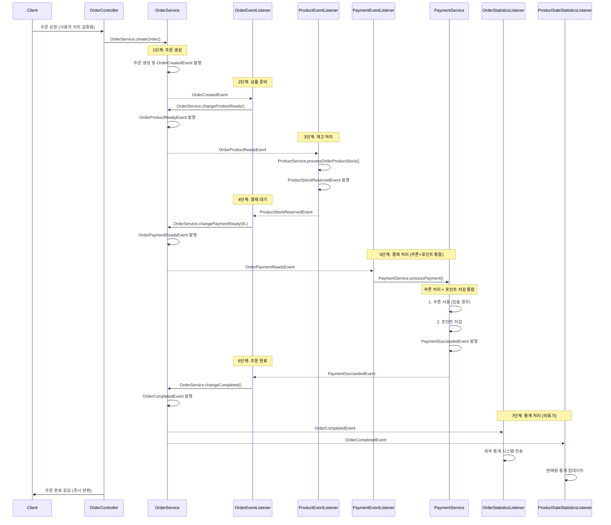
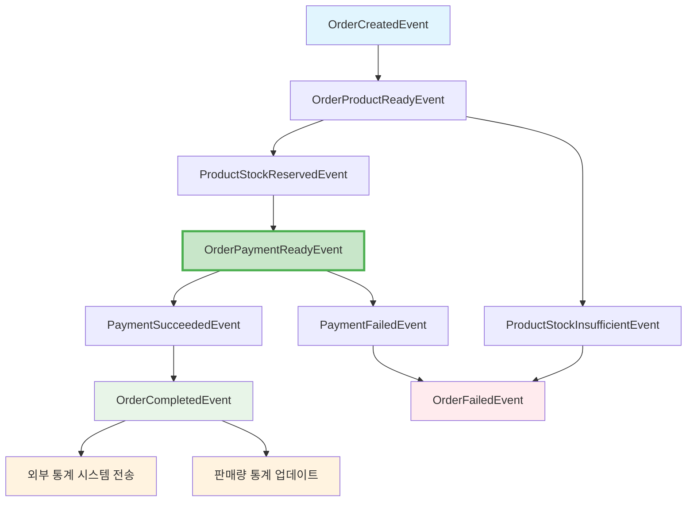
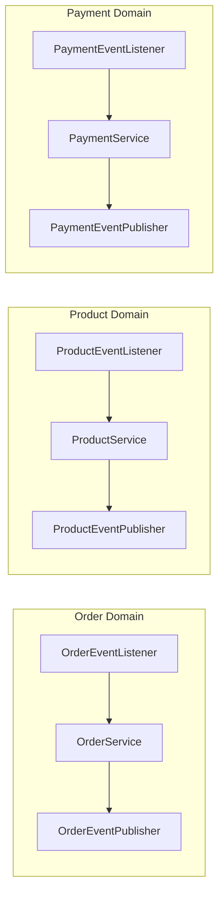

# Event-Driven Architecture 서비스 설계 문서

## 1. Facade 패턴에서 Event-Driven 패턴으로의 전환

### 1.1 제거된 파일
- **`OrderFacade.kt` - 제거됨**

### 1.2 구현 완료된 파일들
- `OrderEventListener.kt` - 주문 상태 변경 이벤트 처리
- `ProductEventListener.kt` - 상품 재고 처리 이벤트 처리
- `PaymentEventListener.kt` - 결제 처리 이벤트 처리
- `OrderStatisticsEventListener.kt` - 외부 통계 시스템 전송 처리
- `ProductSaleStatisticsEventListener.kt` - 판매량 통계 업데이트 처리
- `OrderEventPublisher.kt` - 주문 도메인 이벤트 발행
- `ProductEventPublisher.kt` - 상품 도메인 이벤트 발행
- `PaymentEventPublisher.kt` - 결제 도메인 이벤트 발행


### 1.3 기존 Facade 패턴의 문제점

**현재 OrderFacade.processOrder()의 단일 트랜잭션 처리:**
```kotlin
@Transactional
fun processOrder(orderCriteria: OrderCriteria): Order {
    // 1. 유저 검증 (MSA 환경에서는 공통화되므로 제거 예정)
    // 2. 주문 생성
    // 3. 상품 준비중 상태로 변경
    // 4. 상품 재고 확인 및 차감
    // 5. 쿠폰 사용 처리
    // 6. 결제 대기 상태로 변경
    // 7. 결제 처리
    // 8. 결제 성공 상태로 변경
    // 9. 주문 완료 상태로 변경
    // 10. 외부 통계 시스템에 주문 정보 전송(이벤트 발행)
    // 11. 판매량 통계 업데이트(이벤트 발행)
}
```

**문제점:**
- 모든 도메인 서비스가 하나의 트랜잭션에 묶임
- 하나의 서비스 실패 시 전체 롤백
- 도메인 간 강한 결합
- MSA 환경으로 전환 시 어려움

### 1.4 Event-Driven으로 전환된 아키텍처 특징

**Listener → Service → Publisher 구조 적용:**
- **Listener**: 이벤트 수신 및 Service 호출
- **Service**: 기존 비즈니스 로직 처리 (재사용)
- **Publisher**: 도메인별 이벤트 발행 인터페이스

**트랜잭션 분리:**
- **주문 요청 시작**: Controller → OrderService (독립 트랜잭션)
- **각 단계별 처리**: 각 도메인 서비스별 독립 트랜잭션
- **이벤트 연결**: Spring ApplicationEvent로 단계별 연결
- **보상 트랜잭션**: 실패 시 독립적인 보상 처리

## 2. Event-Driven 주문 처리 흐름 설계

### 2.1 실제 구현된 이벤트 플로우



### 2.2 도메인별 이벤트 정의

#### Order Domain Events
```kotlin
// 주문 생성 완료
data class OrderCreatedEvent(
    val orderId: Long,
    val userId: Long,
    val orderItems: List<OrderItemData>,
    val usedCouponId: Long?
)

// 주문 상품 준비 완료
data class OrderProductReadyEvent(
    val orderId: Long,
    val userId: Long,
    val orderItems: List<OrderItemData>
)

// 주문 결제 대기 상태
data class OrderPaymentReadyEvent(
    val orderId: Long,
    val userId: Long,
    val totalAmount: Long,
    val usedCouponId: Long?
)

// 주문 완료
data class OrderCompletedEvent(
    val orderId: Long,
    val userId: Long,
    val totalAmount: Long,
    val orderItems: List<OrderItemData>
)

// 주문 실패
data class OrderFailedEvent(
    val orderId: Long,
    val failureReason: String,
    val failedStep: String
)

// 외부 통계 시스템 전송 요청
data class OrderStatisticsRequestedEvent(
    val orderId: Long,
    val userId: Long,
    val totalAmount: Long,
    val orderItems: List<OrderCompletedEvent.OrderItemEventData>
)
```

#### User Domain Events
```kotlin
// MSA 환경에서는 사용자가 이미 검증된 상태로 요청이 옵니다.
// 따라서 별도의 사용자 검증 이벤트는 제거하였습니다.
```

#### Product Domain Events
```kotlin
// 재고 확보 성공
data class ProductStockReservedEvent(
    val orderId: Long,
    val products: List<ProductReservationData>
)

// 재고 부족
data class ProductStockInsufficientEvent(
    val orderId: Long,
    val insufficientProducts: List<ProductInsufficientData>,
    val reason: String
)
```

#### Coupon Domain Events
```kotlin
// 쿠폰 처리는 PaymentService.processPayment() 내부에서 직접 처리
```

#### Payment Domain Events
```kotlin
// 결제 성공
data class PaymentSucceededEvent(
    val orderId: Long,
    val paymentId: Long,
    val finalAmount: Long
)

// 결제 실패 (재고 복구용 데이터 포함)
data class PaymentFailedEvent(
    val orderId: Long,
    val failureReason: String,
    val orderItems: List<OrderItemCommand> // 🆕 재고 복구용 주문 상품 데이터
)
```

### 2.2 실제 구현된 이벤트 관계도



### 2.3 Listener → Service → Publisher 구조



## 3. 실제 구현된 Event-Driven 아키텍처

### 3.1 완전한 이벤트 플로우 정리

```
OrderCreatedEvent
    ↓ (OrderEventListener)
OrderService.changeProductReady() - 주문 상태를 상품 준비중으로 변경
    ↓ (OrderEventPublisher)
OrderProductReadyEvent
    ↓ (ProductEventListener)
ProductService.processOrderProductStock() - 재고 확인 및 차감
    ↓ (ProductEventPublisher)
ProductStockReservedEvent
    ↓ (OrderEventListener)
OrderService.changePaymentReady(orderId) - 주문 상태를 결제 대기중으로 변경
    ↓ (OrderEventPublisher)
OrderPaymentReadyEvent
    ↓ (PaymentEventListener)
PaymentService.processPayment() - 쿠폰 + 포인트 통합 결제 처리
    ↓ (PaymentEventPublisher)
PaymentSucceededEvent
    ↓ (OrderEventListener)
OrderService.changeCompleted() - 주문 상태를 주문 완료로 변경
    ↓ (OrderEventPublisher)
OrderCompletedEvent
    ↓ (OrderStatisticsEventListener + ProductSaleStatisticsEventListener) - 외부 통계 시스템 전송 + 판매량 통계 업데이트
```

## 4. 결제 실패 보상 트랜잭션(Compensation) 구현

### 4.1 결제 실패 시 보상 로직 개선

**❌ 기존 문제점:**
- 동기적 재고 복구로 인한 트랜잭션 문제
- 재고 복구 실패 시 결제 실패 기록도 롤백되는 위험
- 성능상 블로킹 이슈

**✅ 개선된 구조:**
- **이벤트 기반 비동기 보상**: `PaymentFailedEvent`에 `orderItems` 포함
- **트랜잭션 격리**: `PaymentEventListener`에서 별도 트랜잭션으로 재고 복구

### 4.2 개선된 보상 트랜잭션 플로우

```kotlin
// 1. PaymentService.processPayment() 내 결제 실패 처리
override fun processPayment(command: ProcessPaymentCommand): Payment {
    try {
        // 결제 처리 로직
    } catch (e: Exception) {
        // 결제 실패 이벤트 발행 (재고 복구는 이벤트 리스너에서 비동기 처리)
        paymentEventPublisher.publishPaymentFailed(
            orderId = order.orderId,
            failureReason = e.message ?: "Payment failed",
            orderItems =
                order.orderItems.map {
                    OrderItemCommand(it.productId, it.quantity)
                },
        )

        throw e
    }
}

// 2. PaymentFailedEvent 수신 및 재고 복구 처리
@Async
@TransactionalEventListener(phase = TransactionPhase.AFTER_COMMIT)
fun handlePaymentFailedStockRestore(event: PaymentFailedEvent) {
    try {
        // 별도 트랜잭션에서 재고 복구
        productService.restoreStock(event.orderItems)
    } catch (e: Exception) {
        // 재고 복구 실패는 별도 처리 (알림/모니터링)
        log.error("재고 복구 실패 - 데이터 정합성 이슈 발생")
    }
}
```

## 8. Event-Driven 아키텍처의 장점과 고려사항

### 9.1 장점
1. **도메인 독립성**: 각 도메인이 독립적인 트랜잭션으로 처리
2. **확장성**: 새로운 도메인 추가 시 기존 코드 변경 없음
3. **장애 격리**: 한 도메인의 실패가 다른 도메인에 영향 없음
4. **MSA 준비**: 각 도메인별 독립 배포 준비 완료
5. **테스트 용이성**: 각 이벤트별 독립적인 테스트 가능
6. **Listener → Service → Publisher 구조**: 기존 비즈니스 로직 재사용
7. **인터페이스 분리**: 향후 FeignClient로 쉽게 교체 가능

## 참고사항
### "하위와 같은 좀더 넓은 트랜잭션의 범위를 갖는것이 어떤가?" 에 대한 고찰
- 목적 : 각각의 비즈니스 로직 후 해당 트랜잭션에 "주문 상태 변경"도 포함시킨다.
- 예시
  - OrderCreatedEvent
    - 주문이 정상적으로 생성된 후 발행
  - ProductStockReservedEvent
    - 상품 재고 확인 및 차감 수행
    - 주문이 상품 준비 완료 상태로 변경 수행
  - PaymentSucceededEvent
    - 주문이 결제 대기 상태로 변경 수행
    - 쿠폰 사용 처리 수행
    - 포인트 결제 처리 수행
    - 주문이 결제 성공 상태로 변경 수행
    - 결제가 성공적으로 완료된 후 발행
  - OrderCompletedEvent
    - 주문이 주문 완료 상태로 후 수행
- 채택하지 않은 이유(단점) :
  - 트랜잭션 정합성은 보장할수 있겠지만, 유지보수성이 낮음
  - 예시 : Payment Service에서는 OrderService 주소를 알아야 한다. 결합성 생김.
