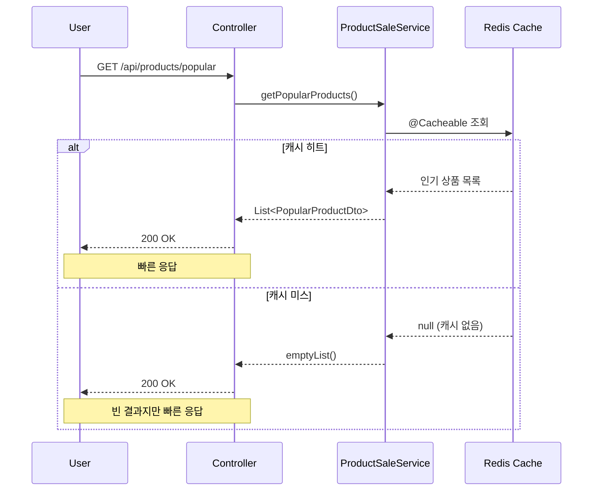
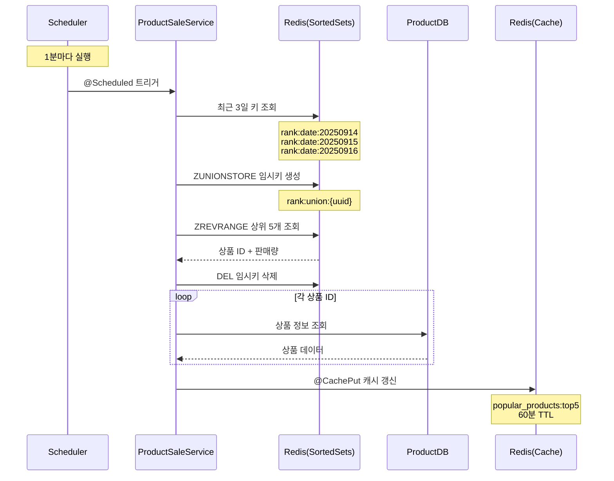

#  상품 인기 판매량 조회 성능 개선
## 목적
- 최근 3일간 가장 많이 팔린 상위 5개 상품 정보를 조회 요청에 대한 응답 속도 개선

## 기존 방식
### 캐시 + DB 조합
- 캐시 : redis 적용
- RDB : MySQL 적용

### 상품 판매량 기록 방법
- 상품이 판매될 때마다 ProductSale 테이블에 (productId,saleDate)를 Id 값으로 upsert 한다.

### 상품 판매량 조회 방법
- "popular_products" 키로 최근 3일간 가장 많이 팔린 상위 5개 상품 정보를 캐싱하여 사용 중
- 캐시 데이터 활용 또는 ProductSale 테이블에서 최근 3일 간의 데이터를 집계하여 상위 5개 상품을 조회한다.

## 신규 방식
### 캐시 + DB 조합
- 캐시 : redis 적용
  - "popular_products::top5" 키로 최근 3일간 가장 많이 팔린 상위 5개 상품 정보를 캐싱
  - "popular_products::top5" 스케줄링을 통한 1분 주기 갱신
- DB : redis 적용
  - redis 의 Sorted Set 자료구조를 활용하여, 상품 판매량을 기록하고 조회한다.
    - key : "rank:date:{yyyyMMdd}" (예: rank:date:20250916)
    - member : productId
    - score : 판매량
    - ttl : 5일

### 상품 판매량 기록 방법
- 상품이 판매될 때마다 redis 의 Sorted Set 에서, 오늘 날짜의 key("rank:date:{yyyyMMdd}") 에 대해 상품 Id 의 score 를 1 증가시킨다.

### 상품 판매량 조회 방법
- "popular_products::top5" 캐시를 조회한다.

### 상품 판매량 캐시 최신화 방법(1분 주기)
1. 최근 3일간의 key ("rank:date:{yyyyMMdd}")를 조회한다.
2. ZUNIONSTORE 명령어를 사용하여, 최근 3일간의 key 들을 합산한 임시 key ("rank:union:{uuid}")를 생성한다.
3. ZREVRANGE 명령어를 사용하여, 임시 key 에서 상위 5개 상품을 조회한다.
4. 임시 key 를 삭제한다.
5. 조회된 상품 Id 들로 상품 정보를 조회하여 반환한다.
6. "popular_products" 캐시를 갱신한다. (Cache Put 방식)

### 신규 장점
- 빠른 응답 속도 : redis 의 인메모리 데이터베이스 특성상, 상품 판매량 조회 속도가 매우 빠르다.
- 간단한 구현 : redis 의 Sorted Set 자료구조를 활용하여, 상품 판매량 기록 및 조회 로직이 간단하다.
- 유지보수 용이 : redis 의 TTL 기능을 활용하여, 오래된 데이터를 자동으로 삭제하여 유지보수가 용이하다.
- 실시간성 : 상품 판매량이 실시간으로 반영되어, 인기 상품 목록이 최신 상태로 유지된다.
- 확장성 : redis 는 분산 환경에서 쉽게 확장할 수 있어, 트래픽 증가에 대응할 수 있다.
