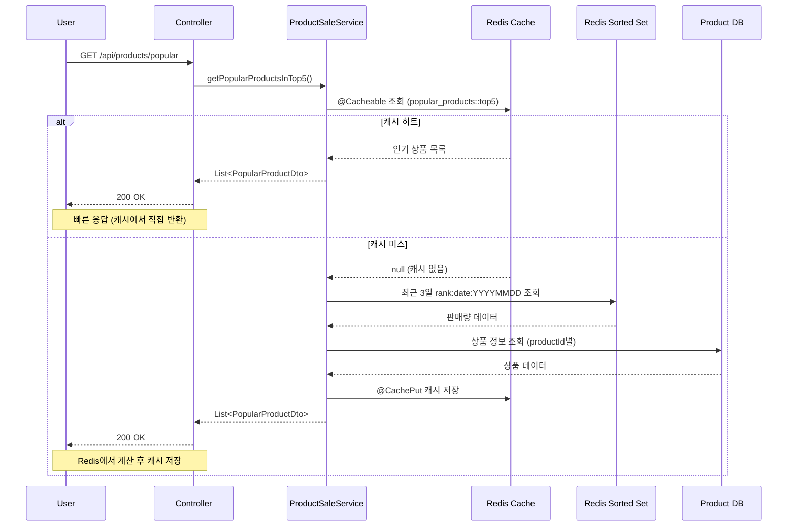
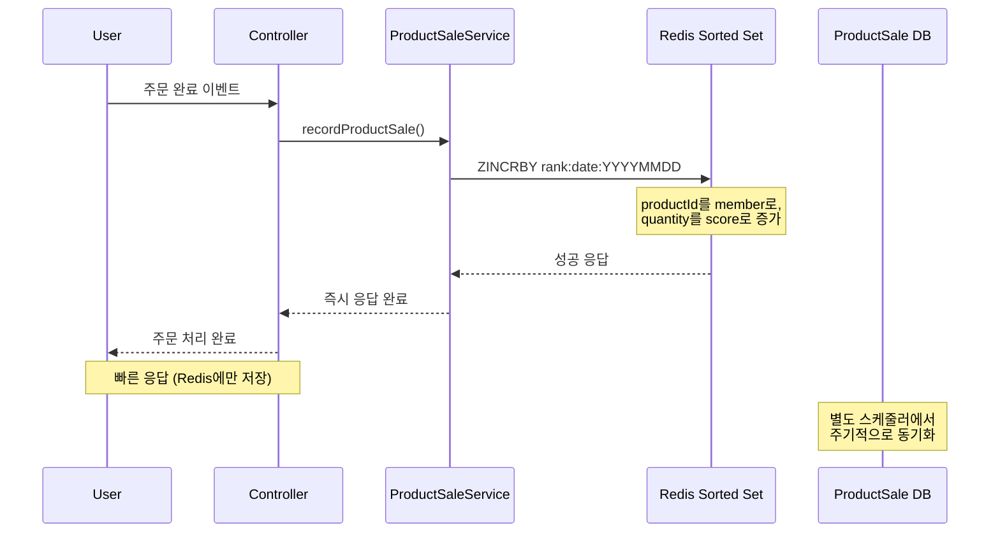
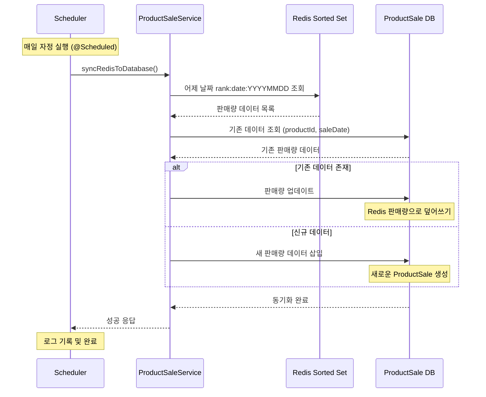

# 인기 상품 TOP5 조회 성능 개선

## 목적
- 오늘을 포함한 최근 3일 동안의 판매량을 집계해서 가장 많이 팔린 상품 5개를 보여주는 기능의 성능 개선
- 높은 조회 요청 수에 대응하여 DB 부하 최소화 및 응답 속도 향상

## 기존 방식 (RDB Only)

### 데이터 삽입
- 현재 판매가 일어나면 상품 재고는 바로 차감되며, ProductSale 테이블에 판매량 데이터를 저장

### 데이터 조회
- ProductSale 테이블에 직접 쿼리하여 최근 3일간의 데이터를 집계하고 판매량 TOP 5 상품을 조회하여 응답

### 장단점
- **단점**
  - 판매량 조회에서 대규모 트래픽 발생 시, 요청마다 RDB 사용으로 인해 connection pool을 초과하여, 병목현상 발생 가능
  - 판매량 집계에서 대규모 트래픽 발생 시, 요청마다 RDB 사용으로 인해 connection pool을 초과하여, 병목현상 발생 가능
  - 매번 복잡한 집계 쿼리 실행으로 인한 성능 저하

## 신규 방식 (Redis 캐시 + RDB 조합)

### 캐시 전략
- **Write-Back 전략**: 판매 데이터를 Redis에 즉시 저장하고, 주기적으로 DB에 동기화
- **Read-Through 전략**: 캐시에서 먼저 조회하고, 없으면 판매 데이터를 Redis에서 계산하여 반환

### 데이터 삽입 (Write-Back 전략)
- **Redis 캐시**: 판매가 일어나면 Redis의 Sorted Set에 판매량 데이터를 저장
  - Key: `rank:date:YYYYMMDD` (예: `rank:date:20250916`)
  - Member: `productId`
  - Score: `totalQuantity` (판매량)
  - TTL: 5일 (자동 만료)
- **RDB 반영**: 매일 자정에 스케줄러가 실행되어 Redis에 쌓여있는 판매량 데이터를 RDB의 ProductSale 테이블에 반영

### 데이터 조회 (Read-Through 전략)
- **1차 캐시**: `popular_products::top5` 키로 최근 3일간 판매량 TOP 5 상품 정보 조회 (TTL: 1분)
- **2차 조회**: 캐시 미스 시 Redis의 `rank:date:YYYYMMDD` 키들을 조회하여 최근 3일간 판매량 TOP 5 계산

### Redis 특성 활용
- **싱글 스레드**: 동시성 이슈 없이 안전한 판매량 증가 처리
- **인메모리 DB**: 빠른 읽기/쓰기 성능으로 높은 처리량 지원
- **TTL 기능**: 자동 데이터 만료로 메모리 관리 최적화
- **Sorted Set**: 자연스러운 순위 관리 및 범위 조회 지원

### 장점
- **성능 향상**: Redis 인메모리 특성으로 빠른 응답 속도
- **DB 부하 감소**: Write-Back 전략으로 DB 쓰기 부하 분산, 읽기 또한 캐시 성능사용으로 인해 DB 읽기 부하 감소
- **동시성 안전**: Redis 싱글 스레드 특성으로 동시성 이슈 해결
- **자동 관리**: TTL로 오래된 데이터 자동 정리

### 추가 고려 참고사항
- **영속성 고려**: Redis 장애 시 데이터 손실 방지를 위한 백업/클러스터링 필요
- **동기화 주기**: Write-Back 전략에서 적절한 동기화 주기 설정 중요

## 인기 상품 조회 플로우 (Read-Through 전략)

## 상품 판매량 기록 플로우 (Write-Back 전략)

## Redis → DB 동기화 플로우 (매일 자정)

