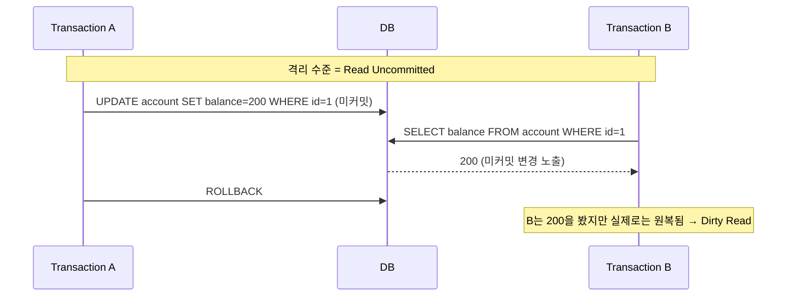
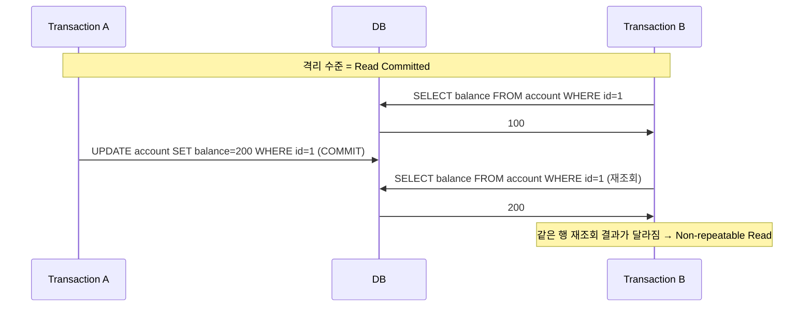
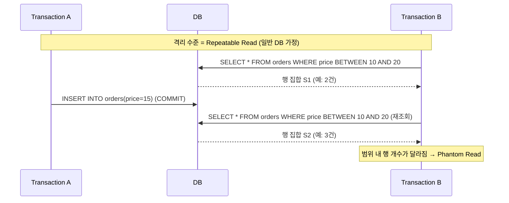
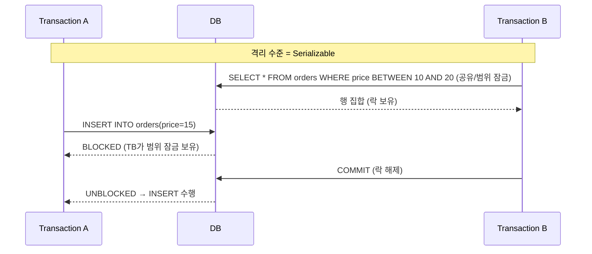

# 트랜잭션 격리 수준(Isolation Level) 보고서

보고서 목적:
트랜잭션 격리 수준 4단계(Read Uncommitted, Read Committed, Repeatable Read, Serializable)의 특성과
각 단계에서 발생 가능한 이상 현상(Dirty Read, Non-repeatable Read, Phantom Read) 및 상위 단계/메커니즘에 의한 해결 방법을 요약한다.

## 목차(개요)

## ACID 원칙(요약)
- 원자성(Atomicity): 전부 성공 또는 전부 실패
- 일관성(Consistency): 트랜잭션 전후 무결성 유지
- 격리성(Isolation): 동시에 수행되는 트랜잭션 간 간섭 최소화/제어
- 영속성(Durability): 커밋된 결과는 이후에도 유지

## 격리 수준별 이상 현상 정리표
| 격리 수준 / 이상 현상 | Dirty read | Non-repeatable read | Phantom read |
|---------------|---|---|---|
| Read uncommitted | O | O | O |
| Read committed |  | O | O |
| Repeatable read |  |  | O |
| Serializable  |  |  |  |
---

## 이상 현상 설명 및 해결 방법

### 1) Dirty Read (Read Uncommitted에서 발생)

설명: A가 커밋하지 않은 변경을 B가 읽는 경우. A가 이후 롤백하면 B는 존재하지 않는 변경을 근거로 처리한 결과를 얻게 된다.

다음 수준에서의 해결: Read Committed는 **각 SELECT 시점의 커밋된 상태만 읽으므로** Dirty Read를 차단한다.

---

### 2) Non-repeatable Read (Read Committed에서 발생)

설명: B가 같은 행을 두 번 읽는 동안, 그 사이에 A가 값을 변경/커밋하면 B가 두 번의 조회에서 서로 다른 값을 보게 된다.

다음 수준에서의 해결: Repeatable Read는 **트랜잭션 시작 시점 스냅샷을 기준으로 일관되게 읽으므로 두 번의 조회가 동일 결과를 보장한다**

---

### 3) Phantom Read (일반적 정의에서 Repeatable Read에서 발생)

설명: B가 범위 조건으로 두 번 읽는 동안, **그 사이에 A가 그 범위에 새로운 행을 삽입/삭제**하여 B가 두 번의 조회에서 서로 다른 “행 집합”을 보게 되는 현상.

참고) InnoDB 일 경우, InnoDB에서는 잠금 읽기(SELECT ... FOR UPDATE 등) 시 Next-Key Lock(레코드+갭 락)으로 해당 범위에 삽입을 차단하여 Phantom Read를 방지한다.

다음 수준에서의 해결: **Serializable은 읽기에도 공유/범위 잠금을 부여하여 범위 내 삽입/수정을 전면 차단, 팬텀을 원천 방지한다.**

---

### 4) Serializable에서의 차단 동작

설명: **완전한 읽기 일관성을 제공하기 위해 읽기 대상(또는 범위)에 잠금을 부여, 충돌하는 쓰기를 대기 또는 차단한다.**

---

## 각 단계 문제와 상위 단계(또는 메커니즘)의 해결 요약

- Read Uncommitted → Read Committed: 커밋된 데이터만 읽는 문장 단위 스냅샷으로 Dirty Read 차단.
- Read Committed → Repeatable Read: 트랜잭션 단위 스냅샷(MVCC)으로 Non-repeatable Read 차단.
- Repeatable Read → Serializable: 공유/범위 잠금으로 Phantom Read 차단(정의상). InnoDB는 RR에서도 Next-Key Lock(잠금 읽기)으로 팬텀 방지가 가능.

## InnoDB 핵심 메커니즘(부록)

- MVCC(다중 버전 동시성 제어): 쓰기와 읽기가 상호 블로킹하지 않도록 스냅샷 버전을 제공, 롤백 세그먼트(Undo) 기반으로 일관 읽기.
- Next-Key Lock(레코드 락 + 갭 락): 범위 내 레코드와 갭 모두를 잠가 삽입/수정을 차단하여 Phantom 방지.
